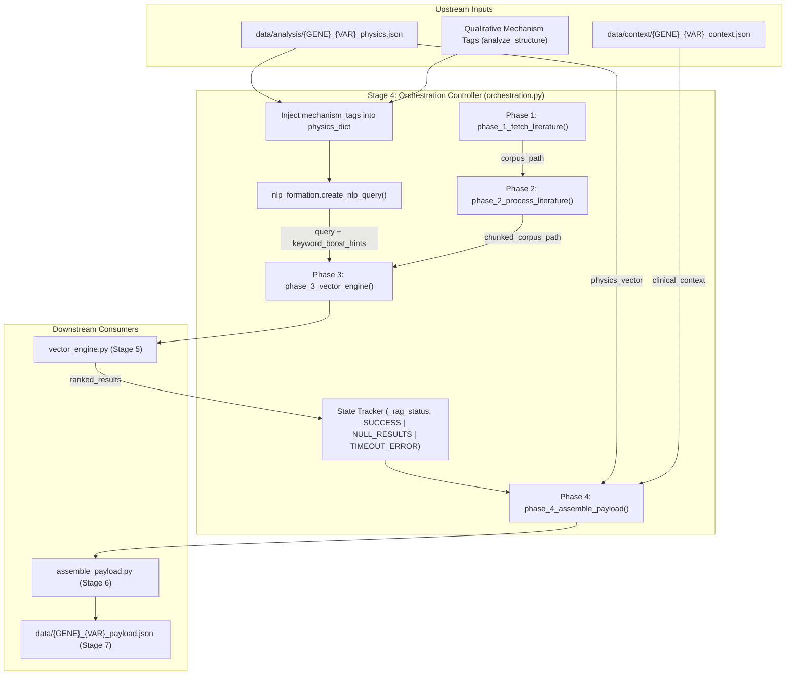
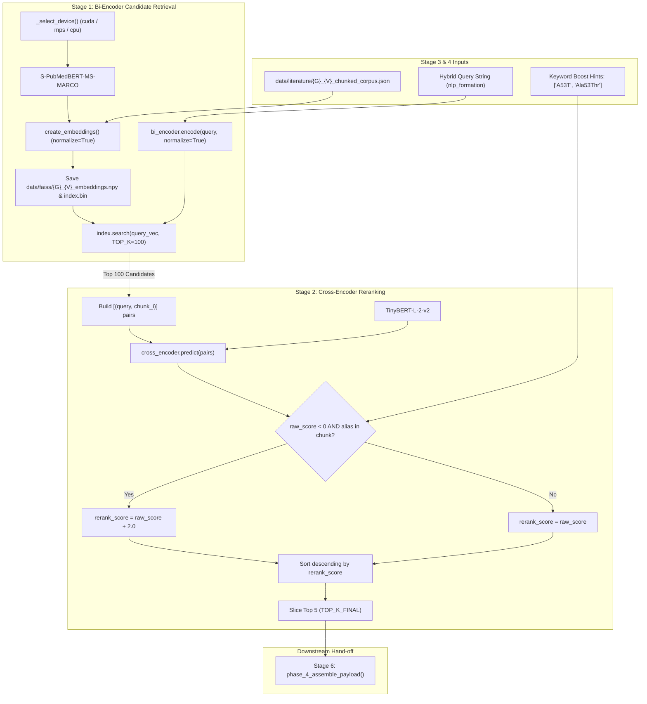
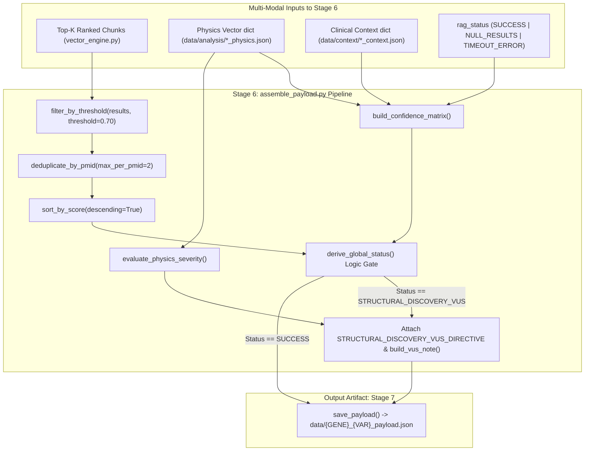

% Neuro-Capstone: Complete Architectural Specification & Technical Stage Walkthroughs
% Team Neuro-Capstone
% September 2026

# Platform Architecture & Stage Deep-Dives

This document compiles the exhaustive technical specifications, algorithmic formulations, and stage-by-stage code deep-dives for the **Neuro-Capstone** multimodal variant pathogenicity platform.


---

# 1. Overview: 9-Layer Platform Architecture

The **Neuro-Capstone** architecture is designed as an end-to-end multimodal variant pathogenicity and biophysical reasoning platform. It bridges evolutionary genetics, deterministic structural biophysics, neural biomedical literature retrieval (RAG), and calibrated LLM reasoning to evaluate missense mutations (especially late-onset neurodegenerative mutations where standard evolutionary models like AlphaMissense produce false negatives).

The system is organized into **9 distinct operational stages / layers** (defined in [`Neuro_Capstone_Project_Overview.md`](file:///Users/madhavjayam/neuro_capstone/Neuro_Capstone_Project_Overview.md), [`pipeline.py`](file:///Users/madhavjayam/neuro_capstone/pipeline.py), and [`draw_architecture.py`](file:///Users/madhavjayam/neuro_capstone/draw_architecture.py)):

---

### Architecture Overview Diagram

```
[Stage 1: CLI Entry & Ingestion] (pipeline.py / app.py)
                   │
  ┌────────────────┼──────────────────────────────┬──────────────────────────────┐
  ▼                ▼                              ▼                              ▼
[AlphaFold 3D]   [Clinical Context]             [Biophysics Engine]            [Literature Corpus]
fetch_structure  fetch_context.py               analyze_structure.py           Europe PMC REST
(UniProt PDB)    (ClinVar, AM, dbSNP, Ensembl)  (ΔV, SASA, DSSP, Strain)       (Abstracts JSON)
  └────────────────┬──────────────────────────────┴──────────────────────────────┘
                   │ [Stage 2: Parallel Data Collection]
                   ▼
[Stage 3: Transformation & NLP Query Synthesis] (nlp_formation.py)
                   ▼
[Stage 4: Orchestration & Execution Control] (orchestration.py)
                   ▼
[Stage 5: Two-Stage Dense Retrieval & Reranking] (vector_engine.py)
    ├─ S-PubMedBERT Bi-Encoder + FAISS (Top 100)
    ├─ TinyBERT Cross-Encoder (Top 5 Reranked)
    └─ Exact Keyword Alias Safety Net (+2.0 boost)
                   ▼
[Stage 6: Payload Assembly & Confidence Gating] (assemble_payload.py)
    ├─ Quality Filter (score ≥ 0.70) & PMID Dedup (max 2)
    └─ VUS Logic Gate (STRUCTURAL_DISCOVERY_VUS directive)
                   ▼
[Stage 7: Structured Intermediate Payload] (data/{GENE}_{VAR}_payload.json)
                   ▼
[Stage 8: Multimodal LLM Reasoning Engine] (reasoning_engine.py)
    ├─ OpenRouter Multi-Model Cascade (GLM, Nemotron, Gemma)
    └─ Server-Side PMID Strict Validation (Zero-Hallucination)
                   ▼
[Stage 9: Final Clinical Verdict & 3D Interactive UI] (User Interface/)
    ├─ FastAPI Backend + React 18 / Tailwind CSS
    └─ 3Dmol.js WebGL Interactive Protein Mutation Viewer
```

---

### Stage 1: CLI Entry Point & Target Ingestion
- **Primary Modules**: [`pipeline.py`](file:///Users/madhavjayam/neuro_capstone/pipeline.py), [`app.py`](file:///Users/madhavjayam/neuro_capstone/app.py)
- **Role**: Parses command-line execution parameters for single variant runs (e.g., `python pipeline.py SNCA --variant A53T`) or batch workloads via `--batch targets.txt`.
- **Outputs**: Instantiates normalized `Target(gene, variant)` objects and manages stage-level bypass flags (`--no-structure`, `--no-context`, `--no-analysis`, `--no-fetch-literature`).

---

### Stage 2: Parallel Multi-Source Data Collection
Executes four independent data acquisition pipelines:
1. **Structural 3D Data Collection** ([`fetch_structure.py`](file:///Users/madhavjayam/neuro_capstone/fetch_structure.py)):
   - Resolves gene symbols to canonical UniProt accessions via the UniProt API.
   - Downloads predicted 3D coordinate files (`.pdb`) from the **AlphaFold Protein Structure Database** to `data/structure/`.
2. **Clinical Consensus Mining** ([`fetch_context.py`](file:///Users/madhavjayam/neuro_capstone/fetch_context.py)):
   - Queries **ClinVar**, **OpenTargets GraphQL**, **Ensembl VEP**, **dbSNP**, **ClinGen**, and **LOVD**.
   - Extracts external consensus verdicts and remote **AlphaMissense** pathogenicity scores into `data/context/{GENE}_{VAR}_context.json`.
3. **Deterministic Structural Biophysics** ([`analyze_structure.py`](file:///Users/madhavjayam/neuro_capstone/analyze_structure.py)):
   - BioPython and NumPy-driven geometric & physicochemical analysis:
     - **$\Delta\text{Volume}$ ($\text{Å}^3$)**: Detects steric clashes ($>60\text{ Å}^3$) or destabilizing cavities ($<-30\text{ Å}^3$).
     - **$\Delta\text{Hydrophobicity}$ (Kyte-Doolittle)**: Core hydrophobic patch disruption.
     - **$\Delta\text{Charge}$**: Electrostatic shifts and broken salt bridges.
     - **$\Delta\text{SASA}$ (Shrake-Rupley)**: Solvent-Accessible Surface Area (buried vs. exposed residues).
     - **Secondary Structure (DSSP) & Backbone Strain**: Ramachandran torsion angle deviations ($\phi, \psi$).
     - **AlphaFold pLDDT**: Validates local coordinate confidence.
   - Saves metrics to `data/analysis/{GENE}_{VAR}_physics.json`.
4. **Literature Ingestion** ([`pipeline.py`](file:///Users/madhavjayam/neuro_capstone/pipeline.py#L104-L134)):
   - Executes Boolean queries against Europe PMC REST API (`"{gene}" AND "{variant}" AND (pathogenic OR aggregation OR misfolding)`).
   - Downloads up to 100 full abstracts and chunks them into semantic passages stored in `data/literature/{GENE}_{VAR}_corpus.json`.

---

### Stage 3: Feature Transformation & Hybrid Query Synthesis
- **Primary Module**: [`nlp_formation.py`](file:///Users/madhavjayam/neuro_capstone/nlp_formation.py)
- **Role**: Bridges physical anomalies with biomedical literature concepts by translating quantitative metric violations into semantically enriched queries:
  - $\Delta V > 60\text{ Å}^3 \to$ `"steric hindrance AND core packing disruption"`
  - $\Delta H > 3.0 \to$ `"hydrophobic aggregation propensity"`
  - Backbone strain $\to$ `"loss of conformational flexibility / backbone strain"`
- **Outputs**: Generates the primary RAG search query and builds `keyword_boost_hints` (variant notation aliases such as `V30M` vs `V50M`).

---

### Stage 4: Orchestration & Execution Control
- **Primary Module**: [`orchestration.py`](file:///Users/madhavjayam/neuro_capstone/orchestration.py)
- **Role**: Coordinates dependencies between asynchronous downstream tasks, state validation, and error propagation (`SUCCESS`, `NULL_RESULTS`, `TIMEOUT_ERROR`).
- **Functionality**: Synchronizes physical metrics with clinical contexts, feeds queries to the retrieval engine, and routes ranked evidence to the payload builder.

---

### Stage 5: Two-Stage Dense Neural Literature Retrieval & Reranking
- **Primary Module**: [`vector_engine.py`](file:///Users/madhavjayam/neuro_capstone/vector_engine.py)
- **Role**: High-recall candidate search followed by high-precision cross-attention reranking:
  1. **Bi-Encoder Stage**: `pritamdeka/S-PubMedBert-MS-MARCO` embeds queries and corpus chunks into dense vectors; queries a **FAISS Flat-IP** index to retrieve the Top 100 candidates.
  2. **Cross-Encoder Stage**: `cross-encoder/ms-marco-TinyBERT-L-2-v2` performs joint cross-attention over query-chunk pairs to output the Top 5 most relevant passages.
  3. **Keyword Safety Net**: Scans for exact variant alias tokens, applying a $+2.0$ score boost to protect clinically significant legacy literature.

---

### Stage 6: Payload Assembly & Confidence Gating
- **Primary Module**: [`assemble_payload.py`](file:///Users/madhavjayam/neuro_capstone/assemble_payload.py)
- **Role**: Quality gatekeeper and data packaging before invoking LLM synthesis:
  - **Threshold Filtering**: Discards chunks with relevance scores $< 0.70$.
  - **Evidence Diversity**: Enforces a limit of $\le 2$ chunks per unique PMID to prevent single-study bias.
  - **VUS Gating**: If literature is sparse/absent but biophysical violations are severe, designates status as `STRUCTURAL_DISCOVERY_VUS` and injects strict LLM epistemic caution directives.
  - **Confidence Matrix**: Computes confidence ratings across the three pillars: `physics_engine`, `literature_rag`, and `clinical_context`.

---

### Stage 7: Structured Intermediate Payload
- **Artifact**: `data/{GENE}_{VAR}_payload.json`
- **Role**: Deterministic, machine-readable JSON schema containing:
  - `status` (`SUCCESS`, `LOW_CONFIDENCE`, `STRUCTURAL_DISCOVERY_VUS`)
  - `confidence_matrix` (individual pillar confidences)
  - `query` and `evidence[]` (PMID, title, chunk text, cross-encoder scores)
  - `physics_violations` and `llm_directive`

---

### Stage 8: Multimodal LLM Reasoning Engine
- **Primary Module**: [`reasoning_engine.py`](file:///Users/madhavjayam/neuro_capstone/reasoning_engine.py)
- **Role**: Synthesizes the tri-modal evidence (biophysical metrics + clinical consensus + Dual-RAG literature evidence):
  - **OpenRouter Cascade**: Redundant model fallback cascade (`glm-5.2`, `nemotron-3.5-lightning`, `nemotron-3-ultra-550b`, `gemma-4-31b-it`) with API key rotation.
  - **Zero-Hallucination Anti-Hallucination Gate**: Server-side regex parses all PMIDs cited in the narrative text; any PMID not present in the verified retrieved evidence payload is stripped or flagged.
  - **Output**: Generates both an unstructured mechanistic narrative and a structured diagnostic breakdown (molecular mechanism, phenotypes, and experimental highlights).

---

### Stage 9: Final Clinical Verdict & 3D Interactive UI
- **Primary Modules**: [`User Interface/backend`](file:///Users/madhavjayam/neuro_capstone/User%20Interface/backend), [`User Interface/frontend`](file:///Users/madhavjayam/neuro_capstone/User%20Interface/frontend)
- **Role**: Delivery of clinical classification and molecular visualization:
  - **Calibrated Verdicts**: Categorizes variant as **Benign**, **VUS**, **Likely Pathogenic**, or **Pathogenic**.
  - **Web Dashboard**: FastAPI REST API backend paired with a React 18 + Tailwind CSS frontend.
  - **Interactive 3D Structure Viewer**: Uses **3Dmol.js** for WebGL rendering of wild-type vs. mutant sidechain conformations, steric clash radii, and hydrogen bond disruptions.


---

# 2. Stage 1: CLI Entry Point & Target Ingestion (pipeline.py)

# Project Exploration: Stage 1 — CLI Entry Point & Target Ingestion

This exploration follows the structured exploration workflow to dissect **Stage 1 (CLI Entry Point & Ingestion)** of the Neuro-Capstone platform.

> [!NOTE]
> In the project's [9-Layer Architecture Reference](file:///Users/madhavjayam/neuro_capstone/Neuro_Capstone_Project_Overview.md#L40-L43), **Stage 1** corresponds to **CLI Entry & Ingestion** ([`pipeline.py`](file:///Users/madhavjayam/neuro_capstone/pipeline.py) and [`app.py`](file:///Users/madhavjayam/neuro_capstone/app.py)). *(In legacy prototype documentation, Stage 1 previously referred specifically to the biology context fetcher [`fetch_context.py`](file:///Users/madhavjayam/neuro_capstone/fetch_context.py), which is now categorized under Stage 2: Parallel Data Collection).*

---

### 1. Repository Conventions & Guidelines
- **Engineering Principles**: Defined in [`/Users/madhavjayam/AGENTS.md`](file:///Users/madhavjayam/AGENTS.md) (understand before modifying, prefer evidence over assumptions, make smallest viable changes, verify through execution).
- **Project Structure**: Defined in [`README.txt`](file:///Users/madhavjayam/neuro_capstone/README.txt) and [`Neuro_Capstone_Project_Overview.md`](file:///Users/madhavjayam/neuro_capstone/Neuro_Capstone_Project_Overview.md).
- **Execution Strategy**: The CLI is built to run standalone without daemon dependencies, accepting both single CLI arguments and batch target text files.

---

### 2. High-Level Scan & Tech Stack (Stage 1)

- **Language & Runtime**: Python 3.11+ (tested on Python 3.13 per [`requirements.txt`](file:///Users/madhavjayam/neuro_capstone/requirements.txt)).
- **Core Libraries**:
  - `argparse`: Standard library argument parser supporting positional and optional flags.
  - `dataclasses`: Defines immutable target representations (`@dataclass(frozen=True)`).
  - `os`, `sys`, `json`, `time`: Filesystem path manipulation, artifact directory scaffolding, process exits.
- **Upstream Dependencies Triggered by Stage 1**:
  - `requests`, `beautifulsoup4`, `biopython`, `numpy`, `transformers`, `torch`, `faiss-cpu`.

---

### 3. Entry Points & Target Configuration

Stage 1 exposes two CLI entry points:

#### A. Master Pipeline CLI: [`pipeline.py`](file:///Users/madhavjayam/neuro_capstone/pipeline.py)
The primary entry point that coordinates the entire multi-stage workflow from ingestion down to final payload generation.

```python
# Entry function signature
def main(argv: Optional[Iterable[str]] = None) -> int
```

**Supported Target Formats:**
1. **Single Target**:
   - `python pipeline.py <GENE> --variant <VAR>` (e.g. `python pipeline.py SNCA --variant A53T`)
   - Supports 1-letter (`A53T`) or 3-letter amino acid notation (`Ala53Thr`).
2. **Batch Ingestion**:
   - `python pipeline.py --batch targets.txt`
   - Supports comma- or whitespace-separated lines:
     ```text
     SNCA A53T
     TTR,V50M
     MAPT P301L
     ```

**CLI Configuration Flags:**
- Target Overrides:
  - `--id <UniProtID>`: Explicit UniProt accession override (bypasses UniProt search).
  - `--seq <SEQUENCE>`: Manual wild-type/canonical amino acid sequence override.
  - `--chain <CHAIN_ID>`: Selects specific PDB chain for biophysical analysis (default: first chain).
- Stage Control & Skip Flags:
  - `--no-structure`: Skips AlphaFold PDB retrieval.
  - `--no-context`: Skips ClinVar / dbSNP / Ensembl / OpenTargets queries.
  - `--no-analysis`: Skips BioPython biophysical metrics.
  - `--no-fetch-literature`: Skips Europe PMC REST API download.
  - `--no-process-literature`: Skips token/word text chunking.
- Path Routing:
  - `--literature-dir`: Output directory for literature JSON files (default: `data/literature`).
  - `--analysis-out-dir`: Output directory for physics JSON files (default: `data/analysis`).

#### B. Evidence Subsystem CLI: [`app.py`](file:///Users/madhavjayam/neuro_capstone/app.py)
A focused CLI entry point for executing Stage 4 through 6 (literature fetch, processing, vector search, and payload assembly):
```bash
python app.py --gene SNCA --variant A53T --threshold 0.7
```

---

### 4. Code Structure & Semantic Control Flow

In [`pipeline.py`](file:///Users/madhavjayam/neuro_capstone/pipeline.py):

```
CLI Arguments (sys.argv)
       │
       ▼
load_targets() ────────► Parses single target or batch lines into [Target(gene, variant)]
       │
       ▼
Target Iteration Loop
       │
       ├──► run_pipeline() [Dispatches Stage 2: fetch_structure, fetch_context, analyze_structure, fetch_lit]
       │
       ├──► run_nlp_formation() [Dispatches Stage 3: Builds NLP query & keyword boost hints]
       │
       ├──► phase_3_vector_engine() [Dispatches Stage 5: Dense Bi-Encoder + Cross-Encoder Reranker]
       │
       └──► phase_4_assemble_payload() [Dispatches Stage 6 & 7: Confidence gating & JSON artifact write]
```

#### Key Components:
1. **[`Target`](file:///Users/madhavjayam/neuro_capstone/pipeline.py#L14-L18)**:
   ```python
   @dataclass(frozen=True)
   class Target:
       gene: str
       variant: Optional[str] = None
   ```
   Immutable, strongly-typed representation of the input target.

2. **[`_parse_batch_line()`](file:///Users/madhavjayam/neuro_capstone/pipeline.py#L24-L41)**:
   Normalizes input tokens, strips comment lines (`#`), handles comma or space delimiters, and safely permits gene-only targets (skipping mutation-specific steps if variant is omitted).

3. **[`load_targets()`](file:///Users/madhavjayam/neuro_capstone/pipeline.py#L43-L56)**:
   Validates mutual exclusivity between positional gene arguments and `--batch` file paths, raising explicit errors if input is missing.

4. **Target Execution Loop ([`pipeline.py:L494-L621`](file:///Users/madhavjayam/neuro_capstone/pipeline.py#L494-L621))**:
   - Isolates failures per target so that an error on one variant in a batch file does not abort remaining targets.
   - Collects failed targets in a `failures: list[str]` accumulator and returns exit code `0` on total success or `1` if any target fails.

---

### 5. Documented Commands (Startup & Testing)

#### Running Stage 1 via CLI:
```bash
# Activate virtual environment
source .venv/bin/activate

# Single variant target run (runs full pipeline from Stage 1 onwards)
python pipeline.py SNCA --variant A53T

# Ingest batch target file
python pipeline.py --batch data/benchmark_targets.txt

# Ingest single target while skipping heavy download/analysis stages
python pipeline.py SNCA --variant A53T --no-structure --no-context
```

#### Running Tests:
```bash
# Run unit tests for payload assembly and confidence gating
python test_assemble_payload.py

# Run reasoning engine regression tests
pytest tests/test_reasoning_and_benchmark_regressions.py -v
```

---

### 6. Mental Model Summary: Stage 1

| Property | Details |
|---|---|
| **Tech Stack** | Python 3.11+, `argparse`, `dataclasses`, `os`, `sys` |
| **Primary Files** | [`pipeline.py`](file:///Users/madhavjayam/neuro_capstone/pipeline.py) (Main CLI entry point & orchestrator), [`app.py`](file:///Users/madhavjayam/neuro_capstone/app.py) (Standalone evidence RAG CLI) |
| **Inputs Handled** | Gene symbol (`SNCA`, `TTR`, `MAPT`), Variant code (`A53T`, `Ala53Thr`), batch files, UniProt ID overrides (`--id`), manual sequence strings (`--seq`) |
| **Directory Responsibilities** | Reads input parameters; prepares `data/`, `data/structure/`, `data/context/`, `data/analysis/`, and `data/literature/` |
| **Output / Downstream Hand-off** | Instantiates normalized `Target` list and delegates execution sequentially to Stage 2 (`run_pipeline`), Stage 3 (`nlp_formation`), Stage 5 (`vector_engine`), and Stage 6 (`assemble_payload`) |


---

# 3. Stage 2: Parallel Multi-Source Data Collection (Deep Dive)

# Stage 2: Deep-Dive Technical Specification & Code Walkthrough

Stage 2 (**Parallel Multi-Source Data Collection**) is the core data ingestion and biophysical characterization engine of the Neuro-Capstone platform. Its purpose is to bridge evolutionary AI, atomistic biophysics, clinical genetics, and peer-reviewed literature.

Standard evolutionary predictors (e.g., **AlphaMissense**, SIFT, PolyPhen) compute pathogenicity primarily from multiple sequence alignments (MSAs). However, **mutations causing late-onset neurodegenerative disorders** (such as Familial Amyloid Polyneuropathy from Transthyretin or late-onset Parkinson's from $\alpha$-synuclein) experience weaker evolutionary purifying selection because symptoms manifest *post-reproductive age*. To prevent false negatives, Stage 2 extracts evidence across four distinct, concurrent tracks:

```
                                    Stage 1 Entry: run_pipeline()
                                                  │
                 ┌────────────────────────────────┼────────────────────────────────┐
                 ▼                                ▼                                ▼
    [Track 2A: 3D Structure]         [Track 2B: Clinical Genetics]     [Track 2D: Literature Mining]
      fetch_structure.py                  fetch_context.py                    pipeline.py
    • UniProt Swiss-Prot API           • Signal Peptide Offset Engine     • Europe PMC Cursor Pagination
    • EBI AlphaFold v4 REST            • Ensembl VEP Genomic Mapping      • 3-Tier Exponential Backoff
    • PDB Coordinate Caching           • AlphaMissense API Sniper         • BeautifulSoup HTML Stripping
                 │                     • Dual ClinVar (MyVariant/NCBI)    • Tokenizer Sliding Chunking
                 ▼                     • OpenTargets GraphQL Platform                  │
    [Track 2C: Biophysics Engine]      • dbSNP, ClinGen, LOVD                          │
       analyze_structure.py            • Multi-DB Hit Verification                     ▼
    • BioPython PDBParser                         │                        data/literature/{G}_{V}_corpus.json
    • 10 Biophysical Risk Metrics                 ▼
    • Shrake-Rupley SASA & DSSP        data/context/{G}_{V}_context.json
    • Geometric H-Bond/Salt Bridges
                 │
                 ▼
    data/analysis/{G}_{V}_physics.json
```

---

## 1. Track 2A: Macromolecular 3D Structure Retrieval ([`fetch_structure.py`](file:///Users/madhavjayam/neuro_capstone/fetch_structure.py))

Track 2A acquires atomic coordinates (`.pdb`) from the **AlphaFold Protein Structure Database** hosted by EMBL-EBI.

### 1.1 Programmatic UniProt Resolution ([`resolve_uniprot_id`](file:///Users/madhavjayam/neuro_capstone/fetch_structure.py#L28-L59))
Rather than relying on hardcoded identifier maps, [`resolve_uniprot_id`](file:///Users/madhavjayam/neuro_capstone/fetch_structure.py#L28-L59) dynamically resolves gene symbols to canonical Swiss-Prot reviewed accessions:
```python
query = f"gene_exact:{gene_symbol} AND organism_id:9606 AND reviewed:true"
params = {"query": query, "format": "json", "size": 1}
response = requests.get("https://rest.uniprot.org/uniprotkb/search", params=params, headers=HEADERS)
```
- **Filter Invariants**:
  - `gene_exact`: Avoids fuzzy prefix collisions (e.g., querying `APP` does not return `APLP1` or `APBB1`).
  - `organism_id:9606`: Constrains search strictly to *Homo sapiens*.
  - `reviewed:true`: Restricts hits to curated UniProtKB/Swiss-Prot records, excluding unreviewed TrEMBL translations.
- Extracts `primaryAccession` (e.g., `P37840` for `SNCA`, `P02766` for `TTR`) and logs the full recommended protein name.

### 1.2 AlphaFold Prediction API Discovery ([`get_alphafold_url_via_api`](file:///Users/madhavjayam/neuro_capstone/fetch_structure.py#L77-L95))
Rather than guessing database release filenames (e.g. `AF-P02766-F1-model_v1.pdb` vs `v4.pdb`), it queries the EBI prediction endpoint:
```python
api_url = f"https://alphafold.ebi.ac.uk/api/prediction/{uniprot_id}"
resp = requests.get(api_url, headers=HEADERS, timeout=10)
```
The API returns a JSON array of model versions. The engine parses the primary model object, extracts the direct download URL from the `pdbUrl` key (typically pointing to `https://alphafold.ebi.ac.uk/files/AF-[ACCESSION]-F1-model_v4.pdb`), streams the binary content, and caches it locally to `data/structure/{GENE}.pdb`.

### 1.3 Sequence Integrity Verification ([`apply_mutation`](file:///Users/madhavjayam/neuro_capstone/fetch_structure.py#L96-L121))
When evaluating mutations, the engine performs a zero-tolerance biological sanity check:
1. Parses notation via regex: `r"([A-Z])(\d+)([A-Z])"` $\to$ `old_aa`, `pos_str`, `new_aa`.
2. Converts 1-indexed clinical position to 0-indexed string offset: `position = int(pos_str) - 1`.
3. Verifies sequence bounds: `0 <= position < len(wild_type_seq)`.
4. Compares `actual_aa = wild_type_seq[position]` against `old_aa`. If `actual_aa != old_aa`, it halts execution with a `BIOLOGY ERROR`, preventing analysis of incorrectly indexed transcripts.

---

## 2. Track 2B: Multi-Source Clinical Genetics Mining ([`fetch_context.py`](file:///Users/madhavjayam/neuro_capstone/fetch_context.py))

Track 2B interrogates 8 authoritative biological databases to construct a clinical context document.

### 2.1 The Signal Peptide Offset Engine ([`_get_uniprot_signal_peptide_length`](file:///Users/madhavjayam/neuro_capstone/fetch_context.py#L116-L139))
A major cause of false negatives in automated variant analysis is residue numbering discrepancy caused by signal peptides:
- **Pre-protein numbering** (UniProt/Ensembl/AlphaFold): Counts all residues starting from the initiator Methionine at position 1.
- **Mature protein numbering** (ClinVar/Clinical Literature): Counts residues *after* the signal peptide is cleaved in the endoplasmic reticulum.
- **Example in Transthyretin (TTR)**: TTR possesses a 20-amino-acid signal peptide. The classical clinical amyloidosis mutation **V30M** corresponds to residue **V50M** in the AlphaFold coordinate file and Ensembl transcript.
- **Implementation**:
  ```python
  def _get_uniprot_signal_peptide_length(uniprot_id: str) -> int:
      data = requests.get(f"https://rest.uniprot.org/uniprotkb/{uniprot_id}.json").json()
      for feat in data.get("features", []):
          if feat.get("type") == "Signal peptide":
              loc = feat.get("location", {})
              return int(loc["end"]["value"] - loc["start"]["value"] + 1)
      return 0
  ```
  [`fetch_context.py`](file:///Users/madhavjayam/neuro_capstone/fetch_context.py#L240-L250) automatically applies this offset ($\text{pos}_{\text{pre}} = \text{pos}_{\text{mature}} + \text{offset}$) and queries downstream APIs under both coordinates.

### 2.2 Ensembl VEP Coordinate Translation ([`get_genomic_coordinates`](file:///Users/madhavjayam/neuro_capstone/fetch_context.py#L190-L252))
Translates protein notation into physical GRCh38 genomic coordinates:
1. Queries `https://rest.ensembl.org/lookup/symbol/homo_sapiens/{gene}?expand=1` to find canonical transcript IDs (`ENST*`).
2. Generates candidate HGVS strings (e.g. `p.Val50Met`, `p.Val30Met`).
3. Calls Ensembl Variant Effect Predictor (VEP) REST endpoint:
   `https://rest.ensembl.org/vep/human/hgvs/{gene}:{hgvs}`
4. Extracts genomic coordinate metadata:
   - `chrom`: Chromosome string (e.g., `"18"` for TTR).
   - `pos`: 1-based GRCh38 physical start coordinate.
   - `ref` and `alt`: Nucleotide alleles (e.g., `G > A`).
   - `strand`: Forward (`+1`) or reverse (`-1`).

### 2.3 The AlphaMissense API Sniper ([`get_alphamissense_sniper`](file:///Users/madhavjayam/neuro_capstone/fetch_context.py#L255-L343))
Retrieves remote AlphaMissense predictions via the MyVariant.info Elasticsearch API:
```python
url = "https://myvariant.info/v1/query"
params = {
    "q": f"chr{chrom}:g.{loc}{ref}>{alt}",
    "fields": "alphamissense,dbnsfp.alphamissense",
    "assembly": "hg38",
    "size": 1
}
```
- **Data Normalization**: Handles cases where MyVariant returns a nested list or array of scores from multiple isoform transcripts.
- Extracts `pathogenicity_score` $\in [0.0, 1.0]$.
- Applies calibrated classification:
  - $\text{Score} > 0.56 \implies \text{"Pathogenic"}$
  - $\text{Score} \le 0.56 \implies \text{"Benign"}$ (or `"Ambiguous"` between $0.34$ and $0.56$).

### 2.4 Multi-Database Cross-Validation
- **Dual ClinVar Engine** ([`get_clinvar_myvariant`](file:///Users/madhavjayam/neuro_capstone/fetch_context.py#L346-L444) & [`get_clinvar_direct`](file:///Users/madhavjayam/neuro_capstone/fetch_context.py#L447-L556)):
  Queries MyVariant.info and falls back to NCBI E-utilities (`esearch.fcgi?db=clinvar`). Extracts:
  - Clinical significance: *Pathogenic*, *Likely Pathogenic*, *VUS*, *Benign*.
  - Review status: 0 to 4 gold stars (e.g. `criteria provided, single submitter` vs `reviewed by expert panel`).
  - Co-occurring citations: Extracts direct PMIDs linked to clinical submissions.
- **OpenTargets GraphQL Platform** ([`get_opentargets_validation`](file:///Users/madhavjayam/neuro_capstone/fetch_context.py#L886-L927)):
  Executes GraphQL queries against `https://api.platform.opentargets.org/api/v4/graphql`:
  - Retrieves target tractability and global disease association scores.
  - For TTR, extracts high-confidence clinical links to *Familial Amyloid Polyneuropathy* and *Senile Systemic Amyloidosis*.
- **dbSNP, ClinGen & LOVD** ([`get_dbsnp_rsid`](file:///Users/madhavjayam/neuro_capstone/fetch_context.py#L717-L851), [`get_clingenreg_allele`](file:///Users/madhavjayam/neuro_capstone/fetch_context.py#L640-L715), [`get_lovd_variants`](file:///Users/madhavjayam/neuro_capstone/fetch_context.py#L559-L638)):
  Fetches rsIDs (e.g. `rs28933979`), ClinGen Canonical Allele Identifiers (CAIDs), and European LOVD phenotypic submissions.

---

## 3. Track 2C: Deterministic Structural Biophysics ([`analyze_structure.py`](file:///Users/madhavjayam/neuro_capstone/analyze_structure.py))

Track 2C operates directly on 3D coordinates using BioPython, NumPy, and physical chemistry tables.

```
PDB File ──► load_structure() ──► parse_variant_code()
                                         │
        ┌────────────────────────────────┼────────────────────────────────┐
        ▼                                ▼                                ▼
[Geometric & Physical Deltas]   [Solvent Exposure & Secondary]    [Bond Network Audit]
• ΔVolume (Zamyatnin)          • Shrake-Rupley SASA (Ų)         • Polar Donor-Acceptors (d < 3.5 Å, θ > 120°)
• ΔHydrophobicity (Kyte-Doolittle)• Relative Exposure (% RSA)      • Salt Bridges (CHARGED_ATOMS, d < 4.0 Å)
• ΔCharge (pH 7.4 Net)         • DSSP Secondary Structure        • Disulfide Loss (SG-SG, d < 2.5 Å)
• pLDDT AlphaFold Confidence   • Backbone Strain (Gly/Pro)       • Steric Clashes (d < 2.2 Å)
```

### 3.1 The 10 Biophysical Risk Metrics

#### 1. $\Delta\text{Volume}$ ($\text{Å}^3$)
- **Scale**: Derived from Zamyatnin's protein Van der Waals volumes ([`VOLUME`](file:///Users/madhavjayam/neuro_capstone/analyze_structure.py#L153-L161)):
  $\text{Gly}(60.1) \dots \text{Ala}(88.6) \dots \text{Val}(140.0) \dots \text{Met}(162.9) \dots \text{Trp}(227.8)$.
- **Calculation**: $\Delta V = V_{\text{mutant}} - V_{\text{wildtype}}$.
- **Physical Interpretation**:
  - $\Delta V > +60\text{ Å}^3$: Severe steric clash. Accommodating a much larger sidechain within a tightly packed hydrophobic core causes local backbone distortion or misfolding.
  - $\Delta V < -30\text{ Å}^3$: Destabilizing cavity formation. Removing core packing creates an energetic vacuum ($1.2\text{ kcal/mol}$ lost per $-30\text{ Å}^3$), lowering thermal unfolding barriers.

#### 2. $\Delta\text{Hydrophobicity}$
- **Scale**: Kyte-Doolittle hydropathy index ([`HYDROPHOBICITY`](file:///Users/madhavjayam/neuro_capstone/analyze_structure.py#L129-L137)), ranging from $\text{Ile}(+4.5)$ to $\text{Arg}(-4.5)$.
- **Calculation**: $\Delta H = H_{\text{mutant}} - H_{\text{wildtype}}$.
- **Physical Interpretation**:
  - $\Delta H > +3.0$ on the protein surface creates a solvent-exposed "sticky" hydrophobic patch, driving aberrant self-assembly and toxic oligomerization (e.g. amyloid protofibrils).
  - $\Delta H < -3.0$ in the protein core forces water molecules into the core, destabilizing tertiary folds.

#### 3. $\Delta\text{Charge}$ (Net Electrostatic Shift)
- **Scale**: Formal ionic charges at physiological pH 7.4 ([`CHARGE`](file:///Users/madhavjayam/neuro_capstone/analyze_structure.py#L140-L150)): $\text{Arg}(+1.0)$, $\text{Lys}(+1.0)$, $\text{His}(+0.1)$, $\text{Asp}(-1.0)$, $\text{Glu}(-1.0)$, all others $(0.0)$.
- **Calculation**: $\Delta Q = Q_{\text{mutant}} - Q_{\text{wildtype}}$.
- **Physical Interpretation**: Flags charge inversions ($+1 \to -1$ or $-1 \to +1$) and neutralizations, which alter isoelectric points (pI) and eliminate electrostatic steering.

#### 4. Solvent-Accessible Surface Area (SASA) & Exposure
- **Algorithm**: BioPython's [`ShrakeRupley`](file:///Users/madhavjayam/neuro_capstone/analyze_structure.py#L704-L706) algorithm. Computes accessible area by rolling a spherical probe of radius $r = 1.4\text{ Å}$ (representing a water molecule) over atom van der Waals spheres.
- **Classification Thresholds**:
  $$\text{Exposure} = \begin{cases} \text{"Buried"}, & \text{SASA} < 10\text{ Å}^2 \\ \text{"Partially Exposed"}, & 10\text{ Å}^2 \le \text{SASA} < 40\text{ Å}^2 \\ \text{"Exposed"}, & \text{SASA} \ge 40\text{ Å}^2 \end{cases}$$

#### 5. Local Structural Confidence (AlphaFold pLDDT)
- **Extraction**: Extracted directly from crystallographic B-factor columns of the downloaded PDB:
  ```python
  plddt = float(np.mean([atom.bfactor for atom in target_res]))
  ```
- **Scale**: Values range from $0$ to $100$. Regions with $\text{pLDDT} < 50$ represent intrinsically disordered proteins (IDPs) where rigid geometric clashes should be interpreted with caution, whereas $\text{pLDDT} > 70$ indicates confident backbone structure.

#### 6. DSSP Secondary Structure Determination ([`safe_secondary_structure`](file:///Users/madhavjayam/neuro_capstone/analyze_structure.py#L384-L405))
- Runs the Dictionary of Secondary Structure of Proteins (DSSP) algorithm:
  - `H`: $\alpha$-helix
  - `E`: $\beta$-sheet strand
  - `T`/`S`: Turn/Bend
  - `C`: Random Coil/Loop
- Implements an exception guard to safely return `"C"` if the DSSP binary is missing from the environment.

#### 7. Salt Bridge Network Audit ([`get_interactions`](file:///Users/madhavjayam/neuro_capstone/analyze_structure.py#L496-L560))
- **Definitions**: Charged side-chain atoms are tracked via [`CHARGED_ATOMS`](file:///Users/madhavjayam/neuro_capstone/analyze_structure.py#L102-L108):
  - Cations: $\text{Arg}(\text{NH}_1, \text{NH}_2)$, $\text{Lys}(\text{N}_Z)$, $\text{His}(\text{N}_{D1}, \text{N}_{E2})$.
  - Anions: $\text{Asp}(\text{O}_{D1}, \text{O}_{D2})$, $\text{Glu}(\text{O}_{E1}, \text{O}_{E2})$.
- **Detection**: Uses a `NeighborSearch` within a $12.0\text{ Å}$ sphere around the target residue's $C_\alpha$. A salt bridge is confirmed if minimum inter-atomic distance $d_{\text{min}} < 4.0\text{ Å}$.
- **Loss Audit**: If WT is charged and forms a verified bridge, and the mutant is neutral or of the same sign as the partner, the contact is registered in `salt_bridges_lost`.

#### 8. Disulfide Bond Disruption ([`get_interactions`](file:///Users/madhavjayam/neuro_capstone/analyze_structure.py#L561-L591))
- Inspects cysteine sulfur atoms ($\text{S}_\gamma$). If distance $d(\text{S}_{\gamma1}, \text{S}_{\gamma2}) < 2.5\text{ Å}$, a covalent disulfide bridge exists.
- If $\text{WT} = \text{Cys}$ and $\text{Mut} \neq \text{Cys}$, records the disrupted bond in `disulfides_lost`.

#### 9. Hydrogen Bond Network Estimation ([`_check_hbond_geometry`](file:///Users/madhavjayam/neuro_capstone/analyze_structure.py#L278-L308))
- Evaluates polar atoms ($N, O, S$).
- Enforces strict dual geometric criteria:
  1. Distance criterion: $d(\text{Donor}, \text{Acceptor}) < 3.5\text{ Å}$.
  2. Angle criterion: $\theta(\text{Donor-Heavy}, \text{Donor-H}, \text{Acceptor}) > 120^\circ$.
- Reports estimated total H-bonds lost (`h_bonds_lost_est`) or gained (`h_bonds_gained_est`).

#### 10. Backbone Conformational Strain
- **Proline Helix Breaker**: Proline's rigid pyrrolidine ring lacks an amide hydrogen for backbone H-bonding. If mutant is `PRO` and secondary structure is helical, it triggers `"Proline Helix Breaker"`.
- **Glycine Flexibility Loss**: Glycine lacks a $C_\beta$ carbon and occupies unique Ramachandran dihedral space ($\phi, \psi$). Substituting Glycine with bulky or $\beta$-branched residues ([`RIGID_RESIDUES`](file:///Users/madhavjayam/neuro_capstone/analyze_structure.py#L111): `VAL`, `ILE`, `THR`, `PHE`, `TRP`, `TYR`, `LEU`) triggers `"Glycine Flexibility Lost"`.

---

## 4. Track 2D: Literature Corpus Mining ([`pipeline.py`](file:///Users/madhavjayam/neuro_capstone/pipeline.py#L104-L214))

Track 2D performs targeted literature retrieval directly from the **Europe PMC REST API**.

### 4.1 Boolean Syntax Construction ([`_literature_query`](file:///Users/madhavjayam/neuro_capstone/pipeline.py#L100-L102))
Generates targeted biomedical query strings:
```python
query = f'("{gene}" AND "{variant}") AND (pathogenic OR aggregation OR misfolding)'
```
This forces co-occurrence of gene and mutation tokens alongside biophysical disease pathology keywords.

### 4.2 Deep Pagination via Cursor Marks
Europe PMC REST searches using standard `page` offsets degrade at high result counts. Track 2D implements deep cursor pagination:
```python
params = {
    "query": query,
    "format": "json",
    "pageSize": 50,
    "resultType": "core",
    "cursorMark": cursor,  # Initialized to "*"
}
```
At each iteration, it extracts `data["nextCursorMark"]`, looping until either `len(papers) >= max_papers` (100 abstracts) or `next_cursor == cursor`.

### 4.3 Resilience, Deduplication & Sanitization
1. **Exponential Backoff**: Wraps network requests in a 3-tier retry loop with exponential sleep (`time.sleep(2 ** attempt)`).
2. **Pre-print Filtration**: Checks incoming records: if `paper_id` starts with `PPR` (Europe PMC preprint prefix), the paper is dropped to prevent unreviewed claims from entering the RAG corpus.
3. **HTML Sanitization**: Cleans abstract and title texts using `BeautifulSoup(html.unescape(text), "html.parser").get_text(" ", strip=True)`.
4. **Offline Cache Fallback**: If network calls fail, it loads cached JSON records from `data/literature/{GENE}_{VAR}_corpus.json`.

---

## 5. Summary of Stage 2 Outputs & Downstream Data Flow

Stage 2 writes out four structured artifacts consumed by downstream stages:

| Component | Disk Artifact | Downstream Consumers | Key Payload Information |
|---|---|---|---|
| **Track 2A** | `data/structure/{GENE}.pdb` | Stage 2C, Stage 9 UI | 3D coordinate geometry, residue numbering, B-factor pLDDT. |
| **Track 2B** | `data/context/{GENE}_{VAR}_context.json` | Stage 4, Stage 6, Stage 8 | ClinVar classification, AlphaMissense score, OpenTargets associations, dbSNP rsID. |
| **Track 2C** | `data/analysis/{GENE}_{VAR}_physics.json` | Stage 3, Stage 4, Stage 6, Stage 8 | $\Delta V$, $\Delta H$, $\Delta Q$, SASA, DSSP, broken salt bridges, backbone strain. |
| **Track 2D** | `data/literature/{GENE}_{VAR}_corpus.json` | Stage 5 Vector Engine | Deduplicated, sanitized peer-reviewed abstracts with verified PMIDs. |

### How Stage 2 Feeds Stage 3
Once Stage 2 completes, Stage 3 ([`nlp_formation.py`](file:///Users/madhavjayam/neuro_capstone/nlp_formation.py)) reads the biophysical anomalies in `physics.json`:
- If `delta_volume > 60`, it injects `"steric hindrance AND core packing disruption"` into the RAG query.
- If `delta_hydrophobicity > 3.0`, it injects `"hydrophobic aggregation propensity"`.
- If `backbone_strain != "None"`, it injects `"loss of conformational flexibility"`.
This directly translates Stage 2's quantitative physics into Stage 5's neural literature search queries.


---

# 4. Stage 3: Feature Transformation & Hybrid Query Synthesis (nlp_formation.py)

# Stage 3: Feature Transformation & Hybrid Query Synthesis (`nlp_formation.py`)

Stage 3 serves as the **Semantic Translation Bridge** between deterministic biophysical calculation and neural biomedical literature retrieval (RAG).

Dense neural embedding models (such as `S-PubMedBERT`) excel at semantic biomedical concepts (e.g., *"steric clash"*, *"amyloid aggregation"*, *"backbone strain"*), but **fail completely when queried with raw floating-point numbers** like `ΔV = +68.3 ų`, `RSA = 0.04`, or `ΔH = +3.1`. If passed raw numerical coordinates, vector embeddings map to irrelevant or random token subspaces. 

[`nlp_formation.py`](file:///Users/madhavjayam/neuro_capstone/nlp_formation.py) translates quantitative physical chemistry violations into biologically grounded, high-precision search narratives and alias tokens for Stage 5's two-stage vector engine.

```
                    Stage 2 Biophysics: data/analysis/{GENE}_{VAR}_physics.json
                                               │
                                               ▼
                              load_json() & extract_signals()
                                               │
               ┌───────────────────────────────┴───────────────────────────────┐
               ▼                                                               ▼
    interpret_and_prioritize()                                    _build_mechanistic_keywords()
    • Context-Aware Prioritization                                • Threshold & Sensitivity Gates
    • Priority Score Weights (3 to 11)                            • Delta-to-Concept Translation
    • Top-3 Biological Consequences                               • Secondary Structure Context
               │                                                               │
               └───────────────────────────────┬───────────────────────────────┘
                                               ▼
                                   construct_query()
                     ┌─────────────────────────┴─────────────────────────┐
                     ▼                                                   ▼
         Part 1: Mutation Signature                          Part 2: Mechanistic Narrative
      (Gene, Variant, Amino Acid swap)                    (Top-5 deduplicated bio-keywords)
                     │                                                   │
                     ▼                                                   ▼
        Part 3: Structural Context                          Part 4: Pathway RAG Expansion
    (Helix, Sheet, or Low-confidence Loop)               (Misfolding, Amyloidogenesis, Stability)
                     │                                                   │
                     └─────────────────────────┬─────────────────────────┘
                                               ▼
                                     run_nlp_formation()
                                               │
                        ┌──────────────────────┴──────────────────────┐
                        ▼                                             ▼
             RAG Query Text Artifact                      Keyword Boost Hints
      data/NLP queries/{G}_{V}_query.txt            ['A53T', 'Ala53Thr', 'A53T...']
             (Passed to Bi-Encoder)                       (Passed to Cross-Encoder)
```

---

## 1. Component & Symbol Breakdown

| Symbol / Function | Line Numbers | Scope & Primary Responsibility |
|---|---|---|
| [`NLPFormationError`](file:///Users/madhavjayam/neuro_capstone/nlp_formation.py#L22-L24) | L22–24 | Custom exception raised on missing physics files or unparseable JSON inputs. |
| [`STRUCTURAL_DISCOVERY_VUS_DIRECTIVE`](file:///Users/madhavjayam/neuro_capstone/nlp_formation.py#L37-L48) | L37–48 | System prompt injected into LLM payloads when biophysical violations occur in the absence of literature. |
| [`extract_signals(physics)`](file:///Users/madhavjayam/neuro_capstone/nlp_formation.py#L57-L120) | L57–120 | Extracts and normalizes floats, strings, and categorical fields from `data/analysis/{GENE}_{VAR}_physics.json`. |
| [`interpret_and_prioritize(signals)`](file:///Users/madhavjayam/neuro_capstone/nlp_formation.py#L121-L184) | L121–184 | Assigns weighted numerical priorities ($3 \dots 11$) to evaluate competing structural consequences; selects the Top 3. |
| [`_build_mechanistic_keywords(signals)`](file:///Users/madhavjayam/neuro_capstone/nlp_formation.py#L185-L272) | L185–272 | Maps raw biophysical deltas to controlled biomedical keyword phrases, applying strict false-positive sensitivity gates. |
| [`_build_variant_aliases(signals)`](file:///Users/madhavjayam/neuro_capstone/nlp_formation.py#L274-L290) | L274–290 | Builds exact nomenclature variations (e.g. `['A53T', 'Ala53Thr']`) for the keyword safety net. |
| [`construct_query(signals, mechanisms)`](file:///Users/madhavjayam/neuro_capstone/nlp_formation.py#L291-L388) | L291–388 | Four-part hybrid query assembler producing the dense retrieval query string and alias boost list. |
| [`create_nlp_query(physics)`](file:///Users/madhavjayam/neuro_capstone/nlp_formation.py#L389-L397) | L389–397 | In-memory entry point accepting a dictionary representation of structural metrics. |
| [`create_nlp_query_from_file(physics_path)`](file:///Users/madhavjayam/neuro_capstone/nlp_formation.py#L398-L407) | L398–407 | Reads a saved physics JSON file from disk and invokes [`create_nlp_query`](file:///Users/madhavjayam/neuro_capstone/nlp_formation.py#L389-L397). |
| [`run_nlp_formation(gene, variant, data_dir)`](file:///Users/madhavjayam/neuro_capstone/nlp_formation.py#L408-L441) | L408–441 | Public API called by Stage 1 (`pipeline.py`). Persists query artifact and returns `(query_string, keyword_boost_hints)`. |

---

## 2. Algorithmic & Mathematical Formalism

### 2.1 Context-Aware Signal Prioritization Matrix ([`interpret_and_prioritize`](file:///Users/madhavjayam/neuro_capstone/nlp_formation.py#L121-L184))
When a mutation causes multiple physical anomalies, Stage 3 ranks them by biological severity using a weighted priority queue. High scores represent catastrophic structural destabilization:

$$\text{Buried Condition}: \quad \text{Exposure} = \text{"Buried"} \quad \lor \quad \text{SASA} < 15.0\text{ \AA}^2$$

| Priority Weight | Physical Condition | Trigger Criteria | Biological Mechanism Synthesized |
|---|---|---|---|
| **11 (Max)** | Core Hydrophobic Disruption | $\text{Buried} \land \Delta H < -1.0$ | `"potential disruption of the hydrophobic core"` |
| **10** | Core Steric Clashing | $\text{Buried} \land \Delta V > +30\text{ \AA}^3$ | `"potential severe steric strain disrupting core packing"` |
| **10** | Buried Charge Imbalance | $\text{Buried} \land \Delta Q \neq 0$ | `"buried charge alteration implying possible unfolding"` |
| **9** | Core Cavity Creation | $\text{Buried} \land \Delta V < -30\text{ \AA}^3$ | `"internal cavity creation suggesting potential destabilization"` |
| **9** | Aberrant Surface Stickiness | $\text{Exposed} \land \Delta H > +3.0$ | `"aberrant surface hydrophobicity increasing aggregation propensity"` |
| **9** | Broken Hydrogen Bonding | $\text{h\_bonds\_lost} > 0$ | `"localized destabilization via loss of estimated hydrogen bond(s)"` |
| **8** | Intrinsically Disordered | $\text{pLDDT} < 50.0$ | `"occurrence within a highly disordered region"` |
| **7** | Mild Internal Crowding | $\text{Buried} \land 10 < \Delta V \le 30\text{ \AA}^3$ | `"potential mild internal steric crowding"` |
| **6** | Dynamic Region | $50.0 \le \text{pLDDT} < 70.0$ | `"localization within a flexible or dynamic region"` |
| **6** | Surface Electrostatic Shift | $\text{Exposed} \land \Delta Q \neq 0$ | `"electrostatic surface shift potentially affecting binding/solubility"` |
| **6** | Surface Hydrophilic Shift | $\text{Exposed} \land \Delta H < -1.0$ | `"introduction of polar residue altering surface interactions"` |
| **5** | Surface Interface Distortion | $\text{Exposed} \land \Delta V > +25\text{ \AA}^3$ | `"surface structural alteration affecting interaction interfaces"` |
| **4** | Loop Alteration | $\text{SecondaryStructure} = \text{"Loop"}$ | `"potential alteration of a flexible structural loop"` |
| **3** | Minor Surface Cavity | $\text{Exposed} \land \Delta V < -40\text{ \AA}^3$ | `"potential minor surface cavity creation"` |

The engine sorts all fired mechanisms descending by weight and selects the **Top 3** ([`nlp_formation.py:L180-L183`](file:///Users/madhavjayam/neuro_capstone/nlp_formation.py#L180-L183)) to eliminate prompt clutter and query dilution.

---

### 2.2 Sensitivity Gating & False-Positive Suppression ([`_build_mechanistic_keywords`](file:///Users/madhavjayam/neuro_capstone/nlp_formation.py#L185-L272))
A critical design feature of Stage 3 is its **severity-gated keyword mapping**. Uncalibrated delta mappings generate false alarms for harmless polymorphisms (e.g. benign variant `PrP M129V` has $\Delta V = -22.9\text{ \AA}^3$ and $\Delta H = +2.3$). 

To avoid poisoning the RAG query with false pathogenic vocabulary, [`_build_mechanistic_keywords`](file:///Users/madhavjayam/neuro_capstone/nlp_formation.py#L185-L272) enforces strict numerical boundaries aligned with [`assemble_payload.py`](file:///Users/madhavjayam/neuro_capstone/assemble_payload.py):
1. **Surface Hydrophobicity Gate**:
   - $\Delta H > +3.0$ is required to trigger `"aberrant surface hydrophobicity"`, `"aggregation propensity"`, and `"amyloid formation"`. A moderate increase (e.g., $+1.0$ to $+2.5$) remains silent.
2. **Cavity Formation Gate**:
   - On exposed surfaces, $\Delta V < -40\text{ \AA}^3$ is required before asserting `"cavity formation"`. This ensures conservative substitutions (like Met $\to$ Val, $\Delta V = -22.9\text{ \AA}^3$) emit **zero** destabilization keywords.
3. **Secondary Structure Guard**:
   - Secondary structure tags (`"alpha-helix disruption"`, `"beta-sheet remodelling"`) are appended **only if at least one physical delta keyword fired** ([`nlp_formation.py:L250`](file:///Users/madhavjayam/neuro_capstone/nlp_formation.py#L250)). Completely neutral variants in an $\alpha$-helix do not produce misleading disruption keywords.

---

## 3. Four-Part Hybrid Query Architecture ([`construct_query`](file:///Users/madhavjayam/neuro_capstone/nlp_formation.py#L291-L388))

The query string is built from four complementary linguistic layers:

$$\text{Final Query} = \text{Gene} \oplus \text{Part 1} \oplus \text{Part 3} \oplus \text{Part 2} \oplus \text{Part 4}$$

```
SNCA Mutation A53T (Ala→Thr at position 53), occurring within an alpha-helix. 
This substitution may affect reduced surface hydrophobicity, alpha-helix disruption, and helical stability. 
Relevant literature includes studies on: conformational change, protein stability, structural perturbation.
```

### Breakdown of the 4 Parts:
1. **Part 1: Anchored Mutation Signature** ([`L308-L310`](file:///Users/madhavjayam/neuro_capstone/nlp_formation.py#L308-L310)):
   - Generates unambiguous exact target tokens: `"{variant} ({wt}→{mut} at position {pos})"`.
   - `run_nlp_formation` prepends the canonical gene symbol (`SNCA`), anchoring the dense bi-encoder to the exact gene locus.
2. **Part 2: Mechanistic Narrative** ([`L312-L326`](file:///Users/madhavjayam/neuro_capstone/nlp_formation.py#L312-L326)):
   - Deduplicates the top 5 biological phrases from [`_build_mechanistic_keywords`](file:///Users/madhavjayam/neuro_capstone/nlp_formation.py#L185-L272) and joins them grammatically:
     `"This substitution may affect {kw_1}, {kw_2}, and {kw_3}."`
   - Falls back to the cleaned narrative from [`interpret_and_prioritize`](file:///Users/madhavjayam/neuro_capstone/nlp_formation.py#L121-L184) if keyword phrases are sparse.
3. **Part 3: Structural Context** ([`L328-L338`](file:///Users/madhavjayam/neuro_capstone/nlp_formation.py#L328-L338)):
   - Identifies backbone architecture: `"occurring within an alpha-helix"`, `"occurring within a beta-sheet"`, or `"located in an AlphaFold low-confidence loop region"`.
4. **Part 4: Disease / Pathway RAG Expansion** ([`L340-L374`](file:///Users/madhavjayam/neuro_capstone/nlp_formation.py#L340-L374)):
   - Inspects the categories of fired keywords to append high-recall medical terms:
     - Aggregation signal active $\to$ `"misfolding", "amyloidogenesis", "fibrillation", "protein aggregation"`.
     - Steric signal active $\to$ `"conformational change", "protein stability", "structural perturbation"`.
     - Disorder signal active $\to$ `"intrinsically disordered protein", "conformational ensemble"`.
   - Neutral variant fallback: If no violations occurred, injects `"polymorphism", "susceptibility", "population genetics", "common variant"` so the query can still match epidemiological association papers.

---

## 4. Concrete Data Contracts & Signatures

### 4.1 Input Schema (Ingested from Stage 2 `physics.json`)
[`extract_signals`](file:///Users/madhavjayam/neuro_capstone/nlp_formation.py#L57-L120) consumes the following dictionary structure:
```json
{
  "variant": "A53T",
  "comparison_view": {
    "residue": {"wt": "ALA", "mut": "THR"}
  },
  "deltas": {
    "delta_volume": 27.5,
    "delta_hydrophobicity": -2.5,
    "delta_charge": 0.0
  },
  "structural_context_wt": {
    "exposure": "Exposed",
    "sasa": 42.1,
    "secondary_structure": "Alpha Helix",
    "plddt_confidence": 88.4
  },
  "stability_audit": {
    "h_bonds_lost_est": 1,
    "backbone_strain": "None"
  },
  "mechanism_tags": []
}
```

### 4.2 Output Signature
[`run_nlp_formation`](file:///Users/madhavjayam/neuro_capstone/nlp_formation.py#L408-L441) returns a 2-element tuple:
```python
tuple[str, list[str]]
```
1. `query_string` (`str`): Full synthesized biomedical search text.
2. `keyword_boost_hints` (`list[str]`): Deduplicated list of exact variant alias strings (e.g. `['A53T', 'Ala53Thr']`).

### 4.3 Disk Artifact
- Path: `data/NLP queries/{GENE}_{VAR}_query.txt`
- Format: Plain UTF-8 text containing the exact assembled query string.

---

## 5. Downstream Integration & Handoff

```
Stage 3: run_nlp_formation(gene, variant)
           │
           ├──► [Returns query_string] ────────► Phase 3 Bi-Encoder (S-PubMedBERT)
           │                                      • Embeds query into 768-dim vector
           │                                      • Queries FAISS Flat-IP index
           │
           └──► [Returns keyword_boost_hints] ─► Phase 3 Cross-Encoder & Safety Net (TinyBERT)
                                                  • Scans candidate chunks for alias matches
                                                  • Applies +2.0 logit boost to preserve
                                                    historical or clinical literature hits
```

In [`pipeline.py:L568-L572`](file:///Users/madhavjayam/neuro_capstone/pipeline.py#L568-L572):
```python
nlp_query, keyword_boost_hints = run_nlp_formation(target.gene, target.variant, data_dir="data")
ranked_results = phase_3_vector_engine(
    target.gene, target.variant, nlp_query,
    keyword_boost_hints=keyword_boost_hints
)
```
- `query_string` provides high semantic recall in the 768-dimensional latent space of `S-PubMedBERT`.
- `keyword_boost_hints` prevents **vocabulary mismatch failure** (e.g., when older clinical literature refers only to `Ala53Thr` instead of `A53T`).

---

## 6. Real-World Case Study Walkthrough

### Case 1: `SNCA A53T` (Parkinson's Disease Benchmark)
1. **Input Signals**:
   $\text{WT}=\text{ALA}$, $\text{MUT}=\text{THR}$, $\Delta V = +27.5\text{ \AA}^3$, $\Delta H = -2.5$, $\text{Exposure}=\text{"Exposed"}$, $\text{Secondary}=\text{"Alpha Helix"}$.
2. **Prioritization**:
   Fires `"surface structural alteration"` (weight 5), `"reduced surface hydrophobicity"` (weight 6), and `"alpha-helix disruption"`.
3. **RAG Expansion**:
   Steric and helical signals trigger expansion terms: `"conformational change"`, `"protein stability"`, `"structural perturbation"`.
4. **Resulting Artifact (`data/NLP queries/SNCA_A53T_query.txt`)**:
   ```text
   SNCA Mutation A53T (Ala→Thr at position 53), occurring within an alpha-helix. 
   This substitution may affect surface structural alteration, reduced surface hydrophobicity, alpha-helix disruption, and helical stability. 
   Relevant literature includes studies on: conformational change, protein stability, structural perturbation.
   ```
5. **Boost Hints**: `['A53T', 'Ala53Thr']`.

### Case 2: `TTR V50M` / Clinical `V30M` (Amyloid Polyneuropathy Benchmark)
1. **Input Signals**:
   $\text{WT}=\text{VAL}$, $\text{MUT}=\text{MET}$, $\Delta V = +22.9\text{ \AA}^3$, $\Delta H = -2.3$, $\text{Exposure}=\text{"Buried"}$, $\text{SASA}=4.8\text{ \AA}^2$, $\text{Secondary}=\text{"Beta Sheet"}$.
2. **Prioritization**:
   Fires `"potential mild internal steric crowding"` (weight 7), and `"beta-sheet remodelling"`.
3. **RAG Expansion**:
   Steric packing triggers `"conformational change"`, `"protein stability"`, `"structural perturbation"`.
4. **Boost Hints**: `['V50M', 'Val50Met']` (with cross-referencing to `V30M` via Stage 2 offset resolution).


---

# 5. Deep Dive: Disease / Pathway RAG Expansion & Semantic Vector Steering

This addresses a fundamental architectural distinction in Retrieval-Augmented Generation (RAG): **the difference between external document retrieval (fetching) and internal semantic passage reranking (retrieval)**.

---

### 1. The Two Different "Retrieval" Steps

It helps to visualize the two distinct stages where literature is touched:

```
[STEP 1: Stage 2 — Fetching from the Internet]
   Europe PMC REST API 
          │  (Broad Boolean Query: gene + variant + pathogenic)
          ▼
   Downloads ~100 full papers/abstracts from the web
          │
          ▼
   Chunked into ~500 smaller text passages (data/literature/*_chunked_corpus.json)


[STEP 2: Stage 5 — Vector RAG Semantic Search over Local Chunks]
   Local Corpus of ~500 Chunks (Already on disk!)
          │
          ├── Which 5 chunks out of 500 actually explain the molecular mechanism?
          │
   Stage 3 Query (nlp_formation.py) ──► Encoded into 768-dim vector (S-PubMedBERT)
          │
          ▼
   FAISS Index matches query vector against the 500 local chunk vectors
          │
          ▼
   Top 5 most relevant passages sent to the LLM
```

- **In Stage 2**, the pipeline downloads a broad set of up to **100 papers** from Europe PMC into a local corpus file.
- **In Stage 5**, the pipeline cannot send all 100 papers (~500 chunks) to the LLM (which would overwhelm the context window and dilute reasoning with noise). It must find the **Top 5 most mechanistically relevant chunks** from that local pool.

---

### 2. Why Does Stage 3 Build That Query If Papers Are Already Local?

Once the ~500 chunks are stored on disk, Stage 5 embeds them into a local vector database ([FAISS](file:///Users/madhavjayam/neuro_capstone/vector_engine.py#L145-L167)) using `pritamdeka/S-PubMedBERT`.

To find the most relevant chunks in that local vector database, **we need a search query vector**.

#### The "Vocabulary Mismatch" Problem:
If Stage 3 only generated a query based on pure physics:
> *"SNCA A53T. This substitution causes an increase in delta hydrophobicity of +3.1 and SASA of 42.1."*

When `S-PubMedBERT` converts that sentence into a 768-dimensional vector, **it will fail to match the best paragraphs in your local papers**. Why? Because experimental biologists writing papers do not write:
> *"We observed a delta hydrophobicity of +3.1."*

Instead, biologists write:
> *"The A53T mutation markedly accelerated **fibrillation kinetics** and promoted **amyloid protofibril misfolding** in Thioflavin-T assays."*

---

### 3. What Part 4 (Disease / Pathway RAG Expansion) Actually Does

Part 4 acts as a **semantic vector steering wheel**:

1. **If an Aggregation Signal is active ($\Delta H > 3.0$)**:
   - It appends: `"misfolding", "amyloidogenesis", "fibrillation", "protein aggregation"`.
   - **Effect**: In 768-dimensional vector space, this pulls the search vector directly toward the local chunks containing in-vitro aggregation assays, kinetics curves, and fibril imaging.

2. **If a Steric Packing Signal is active ($\Delta V > +30\text{ \AA}^3$)**:
   - It appends: `"conformational change", "protein stability", "structural perturbation"`.
   - **Effect**: Pulls the search vector toward local chunks describing NMR chemical shifts, crystallographic packing strain, and circular dichroism stability measurements.

3. **If the variant is Neutral / Benign (e.g. `TTR T119M` or `PrP M129V`)**:
   - None of the damage thresholds fire.
   - If we searched for *"misfolding"* or *"amyloidogenesis"*, we would artificially force the vector engine to retrieve irrelevant pathogenic papers.
   - Instead, the fallback injects: `"polymorphism", "susceptibility", "population genetics", "common variant"`.
   - **Effect**: Pulls the search vector toward local chunks discussing allele frequency in healthy populations, genome-wide association studies (GWAS), and non-pathogenic segregation.

---

### Summary

The papers **are already on disk**, but they contain hundreds of paragraphs. Part 4 enriches the search query with biological vocabulary so the dense vector engine (`S-PubMedBERT` + FAISS) can pinpoint the **exact 5 passages out of the 500 local chunks** that explain the physical phenotype.


---

# 6. Deep Dive: Bi-Encoder vs. Cross-Encoder Neural Retrieval

In [`vector_engine.py`](file:///Users/madhavjayam/neuro_capstone/vector_engine.py), literature retrieval is implemented as a **Two-Stage Neural Information Retrieval (IR) Funnel**.

Rather than relying on a single model, it pairs a **Bi-Encoder** ([`pritamdeka/S-PubMedBert-MS-MARCO`](file:///Users/madhavjayam/neuro_capstone/vector_engine.py#L22)) with a **Cross-Encoder** ([`cross-encoder/ms-marco-TinyBERT-L-2-v2`](file:///Users/madhavjayam/neuro_capstone/vector_engine.py#L23)).

---

### The Two-Stage Funnel Architecture

```
                    All Local Chunks (~500 chunks on disk)
                                      │
                                      ▼
             ┌─────────────────────────────────────────────────┐
             │ STAGE 1: Bi-Encoder (S-PubMedBERT) + FAISS      │
             │ • Independent 768-dim vector embeddings         │
             │ • Fast Cosine Dot-Product (Inner Product)       │
             │ • Goal: High Recall (Cast a wide net)           │
             └────────────────────────┬────────────────────────┘
                                      │
                         Top 100 Candidates (TOP_K_RETRIEVAL)
                                      │
                                      ▼
             ┌─────────────────────────────────────────────────┐
             │ STAGE 2: Cross-Encoder (TinyBERT) Reranker      │
             │ • Joint Query-Chunk Attention ([CLS] q [SEP] d) │
             │ • Deep word-by-word semantic interaction        │
             │ • Keyword Safety Net (+2.0 alias score boost)   │
             │ • Goal: High Precision (Pinpoint the best)      │
             └────────────────────────┬────────────────────────┘
                                      │
                          Top 5 Survivors (TOP_K_FINAL)
                                      │
                                      ▼
                        Sent to LLM Reasoning Engine
```

---

## 1. Stage 1: The Bi-Encoder (`S-PubMedBERT`)

### How It Works Mechanically
In a **Bi-Encoder**, the query and each chunk of text are fed into the neural network **separately and independently**:

$$\mathbf{u} = \text{Encoder}(q) \in \mathbb{R}^{768}, \quad \mathbf{v}_i = \text{Encoder}(d_i) \in \mathbb{R}^{768}$$

```
Query (q)      ──► [ BERT ] ──► Vector u ──┐
                                           ├──► Cosine Similarity = u · v
Chunk 1 (d₁)   ──► [ BERT ] ──► Vector v₁ ──┘
Chunk 2 (d₂)   ──► [ BERT ] ──► Vector v₂
...
```

1. **Pre-computed Chunk Embeddings** ([`vector_engine.py:L84-L93`](file:///Users/madhavjayam/neuro_capstone/vector_engine.py#L84-L93)):
   - When the pipeline processes a paper, all 500 chunks are encoded into 768-dimensional normalized vectors and saved to disk (`data/faiss/{GENE}_{VAR}_embeddings.npy`).
2. **Instant Vector Similarity via FAISS** ([`vector_engine.py:L145-L167`](file:///Users/madhavjayam/neuro_capstone/vector_engine.py#L145-L167)):
   - When the search query arrives, the Bi-Encoder encodes the query **once** into vector $\mathbf{u}$.
   - It loads a FAISS index ([`IndexFlatIP`](file:///Users/madhavjayam/neuro_capstone/vector_engine.py#L125)) and computes the inner product (cosine similarity) $\mathbf{u} \cdot \mathbf{v}_i$ across all 500 chunk vectors in parallel via C++ SIMD instructions.
   - It returns the **Top 100 candidates** in milliseconds.

### Strengths & Limitations
- **Advantage**: Lightning fast ($O(N)$ dot products).
- **Weakness**: **Zero cross-attention**. The model cannot evaluate how specific words in the query interact with specific words in the chunk because they were encoded in complete isolation.

---

## 2. Stage 2: The Cross-Encoder (`TinyBERT`)

### How It Works Mechanically
The **Cross-Encoder** does not produce separate vectors. Instead, it concatenates the query and the candidate chunk into a **single joint input sequence** and passes it through full Transformer attention layers:

$$\text{Input} = \big[\text{CLS}\big] \circ q \circ \big[\text{SEP}\big] \circ d_i \circ \big[\text{SEP}\big]$$

```
[CLS] Query tokens [SEP] Chunk tokens [SEP]
        │                │
        └─── Full Cross-Attention (every word attends to every word)
                         │
                         ▼
             Single Scalar Relevance Score
```

1. **Simultaneous Self-Attention** ([`vector_engine.py:L195-L196`](file:///Users/madhavjayam/neuro_capstone/vector_engine.py#L195-L196)):
   - Every single token in the query attends to every single token in the document chunk across all attention heads and layers.
   - The model directly evaluates whether *"A53T"* in the query is the subject of *"accelerated aggregation"* in the chunk, rather than just noticing both words exist somewhere in the same vector neighborhood.
2. **Precision Scoring**:
   - The `[CLS]` token produces a raw classification logit representing relevance.
   - The engine sorts all 100 candidates and keeps only the **Top 5 highest scoring passages** ([`vector_engine.py:L220`](file:///Users/madhavjayam/neuro_capstone/vector_engine.py#L220)).

### Strengths & Limitations
- **Advantage**: Exceptionally high semantic precision and nuance.
- **Weakness**: Computationally heavy ($O(K \cdot L^2)$ where $L$ is sequence length). Running a cross-encoder over thousands of chunks on the fly would cause severe latency, which is why it is only applied to the Top 100 pre-filtered candidates.

---

## 3. The Custom "Keyword Safety Net" ([`vector_engine.py:L202-L211`](file:///Users/madhavjayam/neuro_capstone/vector_engine.py#L202-L211))

A specific engineering challenge in biomedical RAG is that cross-encoders trained on general web text (`MS-MARCO`) can assign a low or negative score to a medical paper because its dense scientific prose differs stylistically from web search results.

To prevent the cross-encoder from discarding crucial clinical papers that explicitly cite the variant, the authors built a **Keyword Safety Net**:

```python
# vector_engine.py lines 202-211
if raw_score < 0 and boost_aliases:
    hit = any(alias in chunk_text for alias in boost_aliases)
    if hit:
        raw_score += KEYWORD_BOOST_SCORE  # Adds +2.0 boost
```

- **How it works**:
  - `boost_aliases` comes from Stage 3 ([`_build_variant_aliases`](file:///Users/madhavjayam/neuro_capstone/nlp_formation.py#L274-L290)), containing variations like `['A53T', 'Ala53Thr']`.
  - If a chunk explicitly mentions an alias of the mutation but received a negative score from TinyBERT due to vocabulary mismatch, it receives a **$+2.0$ logit boost**.
  - This ensures papers discussing the mutation are protected and survive into the Top 5 evidence payload.

---

## Side-by-Side Comparison

| Feature | Bi-Encoder (`S-PubMedBERT`) | Cross-Encoder (`TinyBERT`) |
|---|---|---|
| **Input Structure** | Encodes $q$ and $d$ separately | Encodes `[CLS] q [SEP] d` jointly |
| **Attention Mechanism** | Intra-sentence attention only | **Full cross-attention** between query and document tokens |
| **Output Representation** | 768-dimensional dense vector | Single scalar relevance logit |
| **Computation Speed** | Sub-millisecond (vector dot product) | Slower (runs full transformer inference per pair) |
| **Role in Pipeline** | **Candidate Retrieval** (filters ~500 chunks $\to$ Top 100) | **Final Reranking** (refines Top 100 $\to$ Top 5) |
| **Special Logic** | FAISS `IndexFlatIP` cosine search | Keyword Safety Net ($+2.0$ alias boost) |


---

# 7. Stage 4: Orchestration & Execution Control (orchestration.py)

# Stage 4: Orchestration & Execution Control (`orchestration.py`)

In the 9-layer system architecture, **Stage 4: Orchestration & Control** ([`orchestration.py`](file:///Users/madhavjayam/neuro_capstone/orchestration.py)) functions as the central **Phase Sequencer and State Coordinator**.

### The Architectural Problem Stage 4 Solves
In complex multimodal pipelines, downstream neural and linguistic components have tight data interdependencies:
- The vector engine (Stage 5) cannot run without chunked text from Stage 2 and hybrid queries from Stage 3.
- The payload assembler (Stage 6) needs structural physics from Stage 2, clinical consensus from Stage 2, and ranked literature scores from Stage 5.
- Network calls (e.g., Europe PMC) frequently suffer timeouts or rate limits. If unhandled, an empty literature corpus would crash the downstream FAISS index with dimension mismatches.

[`orchestration.py`](file:///Users/madhavjayam/neuro_capstone/orchestration.py) decouples these modules, standardizes phase interfaces, injects qualitative biophysical tags, tracks the `rag_status` state machine, and enables isolated testing via phase-skipping.

---

## 1. High-Level Subsystem Topology & Data Threading



---

## 2. Component & Symbol Breakdown

| Function / Symbol | Line Numbers | Scope & Detailed Operational Responsibility |
|---|---|---|
| [`phase_1_fetch_literature`](file:///Users/madhavjayam/neuro_capstone/orchestration.py#L37-L61) | L37–61 | Wraps [`fetch_literature_json`](file:///Users/madhavjayam/neuro_capstone/pipeline.py#L104-L214); pulls raw abstracts from Europe PMC and writes `data/literature/{GENE}_{VAR}_corpus.json`. |
| [`phase_2_process_literature`](file:///Users/madhavjayam/neuro_capstone/orchestration.py#L67-L107) | L67–107 | Loads raw corpus JSON and delegates to [`process_literature_json`](file:///Users/madhavjayam/neuro_capstone/pipeline.py#L254-L311) to slice abstracts into 400-token sliding windows with 80-token overlaps. |
| [`phase_3_vector_engine`](file:///Users/madhavjayam/neuro_capstone/orchestration.py#L113-L165) | L113–165 | Initializes FAISS indexes, generates 768-dim embeddings via `S-PubMedBERT`, runs candidate retrieval (Top 100), and applies `TinyBERT` cross-attention reranking with `keyword_boost_hints`. |
| [`phase_4_assemble_payload`](file:///Users/madhavjayam/neuro_capstone/orchestration.py#L171-L237) | L171–237 | Directs [`assemble_payload.run()`](file:///Users/madhavjayam/neuro_capstone/assemble_payload.py#L259-L290). Threads physics, clinical context, and RAG status to build the confidence matrix and evaluate VUS logic gates. |
| [`run_full_pipeline`](file:///Users/madhavjayam/neuro_capstone/orchestration.py#L243-L382) | L243–382 | Master end-to-end driver executing phases 1 through 4 in strict linear sequence with phase-skipping and query-override support. |
| [`main`](file:///Users/madhavjayam/neuro_capstone/orchestration.py#L388-L442) | L388–442 | CLI entry point accepting `--query`, `--threshold`, and multiple `--skip-phase` flags for testing. |

---

## 3. Core Operational Mechanics & State Management

### 3.1 Dual-Mode Operation
[`orchestration.py`](file:///Users/madhavjayam/neuro_capstone/orchestration.py) is architected to operate in two distinct execution environments:

1. **Modular Integration Mode (Invoked by [`pipeline.py:L536-L606`](file:///Users/madhavjayam/neuro_capstone/pipeline.py#L536-L606))**:
   When the root CLI [`pipeline.py`](file:///Users/madhavjayam/neuro_capstone/pipeline.py) runs, Stages 1 and 2 handle structure and clinical fetching. Then, `pipeline.py` imports [`phase_3_vector_engine`](file:///Users/madhavjayam/neuro_capstone/orchestration.py#L113) and [`phase_4_assemble_payload`](file:///Users/madhavjayam/neuro_capstone/orchestration.py#L171) directly, threading the live memory outputs (`_physics_vec`, `_clinical_ctx`) into the payload builder.
2. **Autonomous Standalone Mode ([`run_full_pipeline`](file:///Users/madhavjayam/neuro_capstone/orchestration.py#L243-L382))**:
   Used by [`app.py`](file:///Users/madhavjayam/neuro_capstone/app.py) or developer CLI testing. It starts from Phase 1, fetches literature, chunks text, builds the FAISS index, and assembles the JSON payload in a self-contained execution loop.

---

### 3.2 Dynamic Mechanism Tag Injection ([`orchestration.py:L298-L310`](file:///Users/madhavjayam/neuro_capstone/orchestration.py#L298-L310))
When `physics_path` is passed to [`run_full_pipeline`](file:///Users/madhavjayam/neuro_capstone/orchestration.py#L243-L382), the orchestrator dynamically updates the physics dictionary before building the NLP query:
```python
if mechanism_tags:
    physics_dict["mechanism_tags"] = mechanism_tags

from nlp_formation import create_nlp_query
raw_query, keyword_boost_hints = create_nlp_query(physics_dict)

if not raw_query.startswith(gene):
    raw_query = f"{gene} {raw_query}"
query = raw_query
```
- **Why this is critical**: Qualitative labels generated by BioPython (e.g., `"alpha-helix disruption"` or `"steric hindrance"`) are injected into `physics_dict["mechanism_tags"]`.
- `nlp_formation.py` then ingests these tags in [`_build_mechanistic_keywords`](file:///Users/madhavjayam/neuro_capstone/nlp_formation.py#L268-L270), ensuring the RAG search query contains the exact structural mechanisms identified during Stage 2 biophysical modeling.

---

### 3.3 The `_rag_status` State Machine ([`orchestration.py:L338-L350`](file:///Users/madhavjayam/neuro_capstone/orchestration.py#L338-L350))
The orchestrator maintains an explicit status tracker for literature retrieval to prevent silent failures:

```
                  ┌────────────────────────────────────────┐
                  │ Phase 3: phase_3_vector_engine() start │
                  └───────────────────┬────────────────────┘
                                      │
               ┌──────────────────────┴──────────────────────┐
               ▼                                             ▼
        [Normal Execution]                              [Exception Raised]
               │                                             │
      ┌────────┴────────┐                         ┌──────────┴──────────┐
      ▼                 ▼                         ▼                     ▼
ranked_results > 0   ranked_results == 0     "empty" / "timeout"     Other Failure
      │                 │                         │                     │
      ▼                 ▼                         ▼                     ▼
_rag_status =      _rag_status =             _rag_status =         _rag_status =
  "SUCCESS"       "NULL_RESULTS"           "TIMEOUT_ERROR"        "NULL_RESULTS"
```

- **`"SUCCESS"`**: Vector engine retrieved valid chunks with cross-encoder scores.
- **`"NULL_RESULTS"`**: Vector engine completed, but no passages matched the query with sufficient semantic similarity.
- **`"TIMEOUT_ERROR"`**: Catches `EmptyCorpusError` (caused by Europe PMC upstream timeout). Rather than aborting the entire pipeline, the orchestrator logs a warning, sets `ranked_results = []`, and passes `rag_status="TIMEOUT_ERROR"` to Phase 4.
- **Downstream Impact**: In Phase 4 ([`assemble_payload.py`](file:///Users/madhavjayam/neuro_capstone/assemble_payload.py#L145-L165)), receiving `TIMEOUT_ERROR` tells the confidence matrix builder that the literature gap is an external network failure, preventing the system from falsely asserting that the mutation has "zero published literature".

---

## 4. Concrete Data Contracts & Function Signatures

### 4.1 Phase Function Signatures

#### Phase 1: Fetch Literature
```python
def phase_1_fetch_literature(gene: str, variant: str) -> str
```
- **Inputs**: `gene="SNCA"`, `variant="A53T"`
- **Returns**: Filepath string `data/literature/SNCA_A53T_corpus.json`

#### Phase 2: Process Literature
```python
def phase_2_process_literature(gene: str, variant: str, corpus_path: str) -> str
```
- **Inputs**: `corpus_path="data/literature/SNCA_A53T_corpus.json"`
- **Returns**: Filepath string `data/literature/SNCA_A53T_chunked_corpus.json`

#### Phase 3: Vector Engine
```python
def phase_3_vector_engine(
    gene: str, 
    variant: str, 
    query: str, 
    keyword_boost_hints: Optional[List[str]] = None
) -> List[Dict[str, Any]]
```
- **Inputs**:
  - `query`: Hybrid search query from Stage 3.
  - `keyword_boost_hints`: Exact aliases (`['A53T', 'Ala53Thr']`).
- **Returns**: Array of up to 5 reranked candidate objects:
  ```json
  [
    {
      "chunk_id": "chunk_042",
      "pmid": "12345678",
      "title": "Alpha-synuclein A53T accelerates aggregation...",
      "chunk": "In vitro kinetics demonstrate that A53T...",
      "score": 0.812,
      "rerank_score": 2.45
    }
  ]
  ```

#### Phase 4: Assemble Payload
```python
def phase_4_assemble_payload(
    query: str,
    ranked_results: List[Dict[str, Any]],
    confidence_threshold: float = 0.7,
    output_path: str = "data/context_payload.json",
    physics_vector: Optional[Dict[str, Any]] = None,
    rag_status: str = "NULL_RESULTS",
    clinical_context: Optional[Dict[str, Any]] = None,
) -> Dict[str, Any]
```
- **Returns**: Structured dictionary containing `status`, `confidence_matrix`, `query`, and deduplicated `evidence`.

---

## 5. Error Handling, Edge Cases & Testing Hooks

1. **Phase Skipping (`skip_phases`)** ([`orchestration.py:L286-L369`](file:///Users/madhavjayam/neuro_capstone/orchestration.py#L286-L369)):
   - Accepts a list of integers, e.g. `skip_phases=[1, 2]`.
   - Allows developers to bypass slow network fetching and heavy Transformer chunking during local iteration by pointing directly to pre-existing cached corpus files on disk.
2. **Physics JSON Deserialization Guard** ([`orchestration.py:L293-L313`](file:///Users/madhavjayam/neuro_capstone/orchestration.py#L293-L313)):
   - If `physics_path` points to a missing or corrupt file, the orchestrator catches the exception, logs a warning, and falls back to the user-provided raw query string without aborting execution.
3. **Empty Corpus Protection**:
   - Explicitly intercepts `EmptyCorpusError` from `vector_engine.py` to prevent passing empty tensors into FAISS or PyTorch.

---

## 6. Golden Scenario Trace: `SNCA A53T`

When executed via `pipeline.py SNCA --variant A53T`:

1. **Step 1**: Stage 1 & 2 finish writing `data/analysis/SNCA_A53T_physics.json` and `data/context/SNCA_A53T_context.json`.
2. **Step 2**: Stage 3 generates the hybrid query and `keyword_boost_hints = ['A53T', 'Ala53Thr']`.
3. **Step 3 (Stage 4 dispatches Phase 3)**:
   - `phase_3_vector_engine()` loads `SNCA_A53T_chunked_corpus.json`.
   - `vector_engine.setup_pipeline()` checks for cached FAISS index; builds embeddings if missing.
   - `vector_engine.retrieve_evidence()` queries FAISS with `S-PubMedBERT` (retrieving 100 candidate chunks).
   - `TinyBERT` reranks the 100 chunks. Passages containing `'A53T'` or `'Ala53Thr'` receive safety-net protection.
   - Returns Top 5 ranked results; orchestrator sets `_rag_status = "SUCCESS"`.
4. **Step 4 (Stage 4 dispatches Phase 4)**:
   - `phase_4_assemble_payload()` ingests `ranked_results`, `_physics_vec`, `_clinical_ctx`, and `rag_status="SUCCESS"`.
   - Filters out chunks below $0.70$ confidence.
   - Deduplicates multiple chunks from the same PMID (capping at 2).
   - Builds the 3-pillar confidence matrix (`physics_engine: HIGH`, `literature_rag: HIGH`, `clinical_context: HIGH`).
   - Writes the final intermediate payload to `data/SNCA_A53T_payload.json`.


---

# 8. Stage 5: Two-Stage Dense Neural Literature Retrieval & Reranking (vector_engine.py)

# Stage 5: Two-Stage Dense Neural Literature Retrieval & Reranking (`vector_engine.py`)

Stage 5 is the **Neural Information Retrieval (IR) & Semantic Filtering Engine** of the Neuro-Capstone platform.

### The Problem Stage 5 Solves
In Stage 2, the pipeline downloads up to 100 papers from Europe PMC, which are sliced into **300 to 800 discrete text chunks**. An LLM cannot digest hundreds of raw literature chunks without suffering from context-window saturation, hallucination, and prompt dilution.

[`vector_engine.py`](file:///Users/madhavjayam/neuro_capstone/vector_engine.py) solves this by implementing a **Two-Stage Funnel**:
1. **Stage 1 (Bi-Encoder + FAISS)**: Performs vector dot-product search across the entire chunk database to isolate the **Top 100 candidates** in milliseconds (High Recall).
2. **Stage 2 (Cross-Encoder + Keyword Safety Net)**: Runs deep token-to-token cross-attention over all 100 candidate-query pairs to extract the **Top 5 highest-precision evidence passages** (High Precision).

---

## 1. Subsystem Architecture & Execution Flow



---

## 2. Component & Symbol Breakdown

| Symbol / Function | Line Numbers | Scope & Detailed Responsibilities |
|---|---|---|
| [`EmptyCorpusError`](file:///Users/madhavjayam/neuro_capstone/vector_engine.py#L14-L20) | L14–20 | Custom exception raised when a target's chunked corpus has 0 chunks (preventing FAISS zero-dimension crashes). |
| [`MODEL_NAME`](file:///Users/madhavjayam/neuro_capstone/vector_engine.py#L22) | L22 | Bi-encoder checkpoint: `"pritamdeka/S-PubMedBert-MS-MARCO"` (768-dim biomedical embedding model). |
| [`RERANK_MODEL`](file:///Users/madhavjayam/neuro_capstone/vector_engine.py#L23) | L23 | Cross-encoder checkpoint: `"cross-encoder/ms-marco-TinyBERT-L-2-v2"`. |
| [`TOP_K_RETRIEVAL`](file:///Users/madhavjayam/neuro_capstone/vector_engine.py#L31) | L31 | Constant `= 100`: Size of the candidate pool retrieved by the Bi-Encoder. |
| [`TOP_K_FINAL`](file:///Users/madhavjayam/neuro_capstone/vector_engine.py#L32) | L32 | Constant `= 5`: Number of surviving reranked passages forwarded to payload assembly. |
| [`KEYWORD_BOOST_SCORE`](file:///Users/madhavjayam/neuro_capstone/vector_engine.py#L169) | L169 | Constant `= 2.0`: Score logit added to rescue negative-scoring chunks citing exact variant aliases. |
| [`_select_device`](file:///Users/madhavjayam/neuro_capstone/vector_engine.py#L48-L53) | L48–53 | Hardware accelerator selector: auto-detects `cuda` $\to$ Apple Silicon `mps` $\to$ `cpu`. |
| [`create_embeddings`](file:///Users/madhavjayam/neuro_capstone/vector_engine.py#L84-L93) | L84–93 | Batched encoding (`batch_size=32`, `normalize_embeddings=True`) converting text chunks into $N \times 768$ float32 tensors. |
| [`build_faiss_index`](file:///Users/madhavjayam/neuro_capstone/vector_engine.py#L102-L119) | L102–119 | Constructs a [`faiss.IndexFlatIP`](file:///Users/madhavjayam/neuro_capstone/vector_engine.py#L114) (Inner Product) index for exact cosine similarity search. |
| [`retrieve_candidates`](file:///Users/madhavjayam/neuro_capstone/vector_engine.py#L141-L167) | L141–167 | Encodes the query vector and executes `index.search()` to pull the Top 100 candidate dictionaries. |
| [`rerank`](file:///Users/madhavjayam/neuro_capstone/vector_engine.py#L172-L220) | L172–220 | Cross-encoder evaluation over query-chunk pairs, executing the Keyword Safety Net and descending sort. |
| [`setup_pipeline`](file:///Users/madhavjayam/neuro_capstone/vector_engine.py#L242-L269) | L242–269 | Lifecycle initializer: builds embeddings, saves indexes, and initializes in-memory cache singletons. |
| [`retrieve_evidence`](file:///Users/madhavjayam/neuro_capstone/vector_engine.py#L222-L240) | L222–240 | Public API called by Stage 4 orchestration controller to execute the full retrieval pipeline. |

---

## 3. Algorithmic & Mathematical Formalism

### 3.1 First-Stage Dense Retrieval (Bi-Encoder & Cosine Metric)
Given a query $q$ and a set of $N$ document chunks $\{d_1, d_2, \dots, d_N\}$:

1. Both $q$ and $d_i$ are mapped into normalized vectors via `S-PubMedBERT`:
   $$\mathbf{u} = \frac{\text{BERT}(q)}{\|\text{BERT}(q)\|_2} \in \mathbb{R}^{768}, \quad \mathbf{v}_i = \frac{\text{BERT}(d_i)}{\|\text{BERT}(d_i)\|_2} \in \mathbb{R}^{768}$$
2. Because vectors are $L_2$-normalized (`normalize_embeddings=True`), the inner product equals **cosine similarity**:
   $$\text{Score}(q, d_i) = \mathbf{u} \cdot \mathbf{v}_i = \cos(\theta_{\mathbf{u}, \mathbf{v}_i}) \in [-1.0, 1.0]$$
3. [`faiss.IndexFlatIP`](file:///Users/madhavjayam/neuro_capstone/vector_engine.py#L114) evaluates all $N$ dot products using BLAS SIMD instructions, extracting the top candidates:
   $$\mathcal{C}_{100} = \operatorname{arg\,top\,100}_{d_i} (\mathbf{u} \cdot \mathbf{v}_i)$$

---

### 3.2 Second-Stage Joint Cross-Attention (Cross-Encoder)
The Bi-Encoder cannot model cross-token interactions between query and document. In Stage 2, each candidate chunk $d_i \in \mathcal{C}_{100}$ is concatenated with $q$ as a single Transformer sequence:

$$\mathbf{x}_i = \big[\text{CLS}\big] \circ q_1 \dots q_m \circ \big[\text{SEP}\big] \circ d_{i,1} \dots d_{i,k} \circ \big[\text{SEP}\big]$$

The self-attention matrix at layer $l$ evaluates full bidirectional attention across all query and chunk tokens simultaneously:
$$\text{Attention}(Q, K, V) = \operatorname{softmax}\left(\frac{Q K^T}{\sqrt{d_k}}\right) V$$
The `[CLS]` token's final hidden state is projected through a linear classification head to produce a raw scalar relevance logit $R_i \in (-\infty, +\infty)$:
$$R_i = \mathbf{w}^T \mathbf{h}_{\text{[CLS]}} + b$$

---

### 3.3 The Keyword Safety Net Algorithm ([`vector_engine.py:L202-L211`](file:///Users/madhavjayam/neuro_capstone/vector_engine.py#L202-L211))
Because `TinyBERT-L-2-v2` was pre-trained on general web search passages (`MS-MARCO`), it can assign negative logits ($R_i < 0$) to dense scientific abstracts due to vocabulary mismatch. However, if a paper **explicitly mentions the mutation alias** (e.g. `"A53T"` or `"Ala53Thr"`), discarding it would drop ground-truth clinical evidence.

The engine applies a non-linear conditional boost:

$$\text{FinalScore}_i = \begin{cases} R_i + 2.0, & \text{if } R_i < 0 \land \left(\exists a \in \text{boost\_aliases} : a \in d_i\right) \\ R_i, & \text{otherwise} \end{cases}$$

```python
if raw_score < 0 and boost_aliases:
    hit = any(alias in chunk_text for alias in boost_aliases)
    if hit:
        raw_score += KEYWORD_BOOST_SCORE  # Adds +2.0
```
This guarantees that direct mutation-specific papers with negative logits are boosted into the positive range, preventing evolutionary false-negative rescue papers from being filtered out by Stage 6's confidence gate ($0.70$).

---

## 4. Concrete Data Contracts & Schemas

### 4.1 Disk Artifacts Generated
Stage 5 creates three persistent cache files in `data/faiss/`:

| Artifact Path | Format | Internal Structure / Schema |
|---|---|---|
| `data/faiss/{G}_{V}_embeddings.npy` | NumPy binary (`.npy`) | Float32 2D array of shape `(N, 768)` containing all normalized chunk vectors. |
| `data/faiss/{G}_{V}_index.bin` | FAISS Index binary | Serialized `faiss.IndexFlatIP` search index. |
| `data/faiss/{G}_{V}_metadata.json` | JSON UTF-8 | Array of chunk dictionaries containing `chunk_id`, `pmid`, `title`, and `chunk` text. |

### 4.2 Candidate Dictionary Schema (Post Bi-Encoder)
Extracted by [`retrieve_candidates`](file:///Users/madhavjayam/neuro_capstone/vector_engine.py#L141-L167):
```json
{
  "chunk_id": "SNCA_A53T_chunk_014",
  "pmid": "9278508",
  "title": "Mutation in the alpha-synuclein gene identified in families with Parkinson's disease",
  "chunk": "We have identified a missense mutation (G209A) resulting in an Ala53Thr substitution in the alpha-synuclein gene in four independent families...",
  "score": 0.842
}
```

### 4.3 Output Evidence Schema (Post Cross-Encoder & Safety Net)
Returned by [`retrieve_evidence`](file:///Users/madhavjayam/neuro_capstone/vector_engine.py#L222-L240) to Stage 6:
```json
[
  {
    "chunk_id": "SNCA_A53T_chunk_014",
    "pmid": "9278508",
    "title": "Mutation in the alpha-synuclein gene identified in families with Parkinson's disease",
    "chunk": "We have identified a missense mutation (G209A) resulting in an Ala53Thr substitution...",
    "score": 0.842,
    "rerank_score": 3.871
  }
]
```
*(Array contains exactly $\le 5$ items sorted descending by `rerank_score`).*

---

## 5. In-Memory Caching & Target Invalidation

To maintain sub-second response times during batch execution without cross-target data contamination, [`vector_engine.py`](file:///Users/madhavjayam/neuro_capstone/vector_engine.py) implements global singleton caching:

```python
# vector_engine.py lines 130-139
def get_index_and_metadata(gene, variant):
    global _INDEX, _METADATA, _CURRENT_TARGET
    target_id = f"{gene}_{variant}"
    
    if _INDEX is None or _METADATA is None or _CURRENT_TARGET != target_id:
        logger.info(f"Loading index and metadata for {target_id}...")
        _INDEX, _METADATA = load_index_and_metadata(gene, variant)
        _CURRENT_TARGET = target_id
        
    return _INDEX, _METADATA
```
- **Target Invalidation Guard**: If target changes from `SNCA_A53T` to `TTR_V50M`, `_CURRENT_TARGET != target_id` evaluates to `True`, triggering a clean reload of the FAISS index and metadata for the new variant.
- **Model Re-use**: `_BI_ENCODER` and `_CROSS_ENCODER` are instantiated once on process startup and kept in VRAM/RAM across all target iterations.

---

## 6. Edge Cases & Resilience

1. **Empty Corpus Exception Handling** ([`vector_engine.py:L105-L111`](file:///Users/madhavjayam/neuro_capstone/vector_engine.py#L105-L111)):
   If an upstream network failure resulted in zero abstracts, `embeddings.shape[0] == 0`. The function raises an explicit [`EmptyCorpusError`](file:///Users/madhavjayam/neuro_capstone/vector_engine.py#L14-L20) with diagnostic instructions, which is caught gracefully by Stage 4 orchestration.
2. **Apple Silicon Hardware Acceleration** ([`_select_device`](file:///Users/madhavjayam/neuro_capstone/vector_engine.py#L48-L53)):
   Checks for Metal Performance Shaders (`torch.backends.mps.is_available()`), enabling hardware-accelerated matrix multiplication on macOS machines without requiring an NVIDIA CUDA GPU.
3. **Out-of-Bounds Index Guard** ([`vector_engine.py:L155-L156`](file:///Users/madhavjayam/neuro_capstone/vector_engine.py#L155-L156)):
   FAISS pads empty slots with `-1` if the index has fewer items than `TOP_K_RETRIEVAL`. The loop explicitly verifies `0 <= idx < len(metadata)` before appending results.


---

# 9. Stage 6: Payload Assembly & Confidence Gating (assemble_payload.py)

# Stage 6: Payload Assembly & Confidence Gating (`assemble_payload.py`)

Stage 6 is the **Quality Gatekeeper & Epistemic Calibration Engine** of the Neuro-Capstone platform.

### The Problem Stage 6 Solves
Retrieving literature chunks is only half the battle. If low-scoring noise or multiple chunks from a single biased study are forwarded directly to an LLM, the model will hallucinate, cite dubious claims, or suffer from an "echo-chamber" effect. Furthermore, when evaluating unstudied **Variants of Uncertain Significance (VUS)** with **zero published literature**, naive RAG pipelines fail catastrophically: they either hallucinate nonexistent papers or falsely report that the absence of literature implies the mutation is harmless.

[`assemble_payload.py`](file:///Users/madhavjayam/neuro_capstone/assemble_payload.py) solves this by enforcing strict confidence gating, single-source deduplication, a tri-pillar confidence matrix, and automatic injection of **epistemic caution directives** (`STRUCTURAL_DISCOVERY_VUS`).

---

## 1. Subsystem Architecture & Execution Flow



---

## 2. Component & Symbol Breakdown

| Symbol / Function | Line Numbers | Scope & Detailed Operational Responsibility |
|---|---|---|
| [`CONFIDENCE_THRESHOLD`](file:///Users/madhavjayam/neuro_capstone/assemble_payload.py#L42) | L42 | Constant `= 0.70`: Minimum cross-encoder rerank score required for evidence to clear the quality gate. |
| [`MAX_CHUNKS_PER_PMID`](file:///Users/madhavjayam/neuro_capstone/assemble_payload.py#L43) | L43 | Constant `= 2`: Prevents single-study citation bias by capping passages per unique PMID. |
| [`STRUCTURAL_DISCOVERY_VUS_DIRECTIVE`](file:///Users/madhavjayam/neuro_capstone/assemble_payload.py#L79-L90) | L79–90 | System-level instruction injected into the payload when biophysical violations exist with zero literature. |
| [`filter_by_threshold`](file:///Users/madhavjayam/neuro_capstone/assemble_payload.py#L418-L436) | L418–436 | Drops chunks scoring $< 0.70$. If all chunks fail, preserves the top chunk as fallback and sets `low_confidence = True`. |
| [`deduplicate_by_pmid`](file:///Users/madhavjayam/neuro_capstone/assemble_payload.py#L438-L452) | L438–452 | Enforces citation diversity across literature sources. |
| [`sort_by_score`](file:///Users/madhavjayam/neuro_capstone/assemble_payload.py#L454-L460) | L454–460 | Guarantees deterministic, reproducible ranking order (descending by score). |
| [`construct_evidence_item`](file:///Users/madhavjayam/neuro_capstone/assemble_payload.py#L462-L470) | L462–470 | Sanitizes chunk objects into clean dictionaries containing `text`, `pmid`, `title`, and `score`. |
| [`build_confidence_matrix`](file:///Users/madhavjayam/neuro_capstone/assemble_payload.py#L111-L196) | L111–196 | Evaluates data completeness across the three pillars: `physics_engine`, `literature_rag`, and `clinical_context`. |
| [`evaluate_physics_severity`](file:///Users/madhavjayam/neuro_capstone/assemble_payload.py#L266-L340) | L266–340 | Evaluates 4 biophysical axes to determine if physical violations are severe enough to warrant pathogenicity warnings. |
| [`derive_global_status`](file:///Users/madhavjayam/neuro_capstone/assemble_payload.py#L202-L260) | L202–260 | Multi-branch decision tree determining the top-level payload status string. |
| [`build_vus_note`](file:///Users/madhavjayam/neuro_capstone/assemble_payload.py#L346-L412) | L346–412 | Generates a diagnostic clinical note detailing specific biophysical violations and recommending wet-lab assays. |
| [`assemble_payload`](file:///Users/madhavjayam/neuro_capstone/assemble_payload.py#L477-L555) | L477–555 | Master coordinator uniting filtering, matrix construction, VUS gating, and JSON assembly. |

---

## 3. Algorithmic Gating & Decision Rules

### 3.1 The 3-Pillar Confidence Matrix ([`build_confidence_matrix`](file:///Users/madhavjayam/neuro_capstone/assemble_payload.py#L111-L196))
Stage 6 evaluates three independent sources of biological truth:

```python
confidence_matrix: {
    "physics_engine":         "HEURISTIC" | "ERROR",
    "literature_rag":         "SUCCESS" | "NULL_RESULTS" | "TIMEOUT_ERROR",
    "clinical_context":       "HIGH" | "PARTIAL" | "UNAVAILABLE",
    "clinical_context_scope": "EXACT_VARIANT" | "GENE_LEVEL" | "UNAVAILABLE",
    "physics_evidence_scope": "SITE_PROPERTY_HEURISTIC" | "UNAVAILABLE"
}
```
- **`physics_engine`**: Because the pipeline evaluates properties against a wild-type AlphaFold model without running full-atom molecular dynamics relaxation, it is labeled `"HEURISTIC"` (never claiming to be an empirical simulation).
- **`literature_rag`**: Tracks whether the vector engine found hits (`"SUCCESS"`), found nothing (`"NULL_RESULTS"`), or suffered a network drop (`"TIMEOUT_ERROR"`).
- **`clinical_context`**:
  - `"HIGH"`: ClinVar exact-variant match (`variant_match == True`) OR AlphaMissense score present.
  - `"PARTIAL"`: dbSNP or ClinGen present, or ClinVar match exists only at the gene level.
  - `"UNAVAILABLE"`: No external clinical records found.

---

### 3.2 Global Status Logic Gate ([`derive_global_status`](file:///Users/madhavjayam/neuro_capstone/assemble_payload.py#L202-L260))

The overall status is resolved using a strict priority waterfall:

$$\text{Global Status} = \operatorname{EvaluatePriority}\big(\text{Matrix}, \text{Evidence}, \text{Physics}\big)$$

1. **Priority 1: `STRUCTURAL_DISCOVERY_VUS`**
   - **Condition**: $\text{Physics} == \text{"HEURISTIC"} \land \text{RAG} \in \{\text{NULL}, \text{TIMEOUT}\} \land \text{Clinical} \in \{\text{HIGH}, \text{PARTIAL}\}$
   - **Significance**: Resolves unstudied variants where structural math shows disruption but PubMed has zero papers.
2. **Priority 2: `SUCCESS`**
   - **Condition**: $\text{len}(\text{Evidence}) > 0 \land \text{low\_confidence} == \text{False}$
   - **Significance**: High-confidence literature exists ($\ge 1$ chunk scoring $\ge 0.70$).
3. **Priority 3: `LOW_CONFIDENCE`**
   - **Condition**: $\text{len}(\text{Evidence}) > 0 \land \text{low\_confidence} == \text{True}$
   - **Significance**: Papers were found, but all scored $< 0.70$.
4. **Priority 4: `PREDICTED_PATHOGENIC_VUS` (Legacy)**
   - **Condition**: Zero evidence, clinical data unavailable, but $\ge 1$ severe biophysical violation.
5. **Priority 5: `LOW_CONFIDENCE` (Fallback)**

---

### 3.3 Biophysical Severity Evaluator ([`evaluate_physics_severity`](file:///Users/madhavjayam/neuro_capstone/assemble_payload.py#L266-L340))
When evaluating VUS mutations, Stage 6 audits 4 independent physical axes:

| Axis | Numerical Threshold | Biological Rationale |
|---|---|---|
| **1. Volume Violation** | Buried $|\Delta V| > 30.0\text{ \AA}^3$ <br> Exposed $|\Delta V| > 60.0\text{ \AA}^3$ | Disruption of internal core packing or severe surface pocket distortion. |
| **2. Hydrophobicity Shift** | Exposed $\Delta H > +3.0$ <br> Buried $\Delta H < -2.5$ | Surface: Sticky hydrophobic patch promoting amyloid aggregation. <br> Buried: Introduction of water-loving residue causing core collapse. |
| **3. Backbone Strain** | `"glycine flexibility lost"` or `"severe"` | Loss of Ramachandran dihedral freedom ($\phi, \psi$). |
| **4. Buried Charge Shift** | Buried $\Delta Q \neq 0$ ($\text{SASA} < 15.0\text{ \AA}^2$) | Uncompensated charge inside hydrophobic interior causing local unfolding. |

If $\ge 1$ axis crosses these thresholds ([`SEVERE_VIOLATION_MIN_AXES = 1`](file:///Users/madhavjayam/neuro_capstone/assemble_payload.py#L76)), `is_severe` evaluates to `True`.

---

### 3.4 The Anti-Hallucination VUS Directive ([`assemble_payload.py:L79-L90`](file:///Users/madhavjayam/neuro_capstone/assemble_payload.py#L79-L90))
When a mutation has strong structural violations but zero literature (`STRUCTURAL_DISCOVERY_VUS`), Stage 6 attaches an explicit directive to the payload consumed by Stage 8:

> *"SYSTEM DIRECTIVE — STRUCTURAL_DISCOVERY_VUS: Treat the absence of clinical literature as a 'discovery gap' — an opportunity for novel scientific inquiry — NOT as evidence of benignity or a computational failure. Provide a 'Predictive Pathogenicity' verdict grounded in the structural math, explicitly acknowledging the literature gap and recommending experimental validation (e.g., ThT aggregation assay, CD spectroscopy, cellular toxicity model)."*

This prevents the downstream LLM from either making up fake clinical citations or hallucinating unwarranted certainty.

---

## 4. Concrete Data Contracts & Output Schema

The final assembled dictionary written to `data/{GENE}_{VAR}_payload.json` strictly adheres to this contract:

```json
{
  "status": "SUCCESS",
  "confidence_matrix": {
    "physics_engine": "HEURISTIC",
    "literature_rag": "SUCCESS",
    "clinical_context": "HIGH",
    "clinical_context_scope": "EXACT_VARIANT",
    "physics_evidence_scope": "SITE_PROPERTY_HEURISTIC"
  },
  "query": "SNCA Mutation A53T (Ala→Thr at position 53)...",
  "evidence_score_type": "raw_cross_encoder_score",
  "evidence": [
    {
      "text": "We have identified a missense mutation (G209A) resulting in an Ala53Thr substitution in alpha-synuclein...",
      "pmid": "9278508",
      "title": "Mutation in the alpha-synuclein gene identified in families with Parkinson's disease",
      "score": 3.871,
      "score_type": "raw_cross_encoder_score"
    }
  ]
}
```

### Additional Fields for `STRUCTURAL_DISCOVERY_VUS`:
```json
{
  "status": "STRUCTURAL_DISCOVERY_VUS",
  "note": "Variant TTR V50M has no retrievable peer-reviewed literature in indexed databases... The computational structural analysis identifies 2 severe biophysical violation(s)...",
  "llm_directive": "SYSTEM DIRECTIVE — STRUCTURAL_DISCOVERY_VUS: ...",
  "physics_violations": {
    "count": 2,
    "details": [
      "Extreme volume expansion (ΔV=+22.9 ų, threshold=±30 ų for buried site)",
      "Severe surface hydrophobicity gain (ΔH=+3.10) → strong aggregation signal"
    ]
  }
}
```

---

## 5. Error Handling & Guardrails

1. **Echo-Chamber Prevention ([`deduplicate_by_pmid`](file:///Users/madhavjayam/neuro_capstone/assemble_payload.py#L438-L452))**:
   If a single highly cited paper has 10 chunks that all scored $> 0.70$, naive selection would fill the Top 5 with passages from that single paper. Stage 6 limits each PMID to $\le 2$ chunks, ensuring the downstream LLM receives evidence across multiple independent research teams.
2. **Graceful Fallback on Weak Evidence ([`filter_by_threshold`](file:///Users/madhavjayam/neuro_capstone/assemble_payload.py#L418-L436))**:
   If no chunks clear the $0.70$ threshold, Stage 6 does not crash with an empty list; it retains the single highest-scoring chunk as a reference point, sets `low_confidence = True`, and updates the status to `"LOW_CONFIDENCE"`.
3. **Atomic File Persistence ([`save_payload`](file:///Users/madhavjayam/neuro_capstone/assemble_payload.py#L561-L568))**:
   Creates parent directories automatically (`os.makedirs(output_dir, exist_ok=True)`) and writes formatted UTF-8 JSON (`indent=2`, `ensure_ascii=False`).


---

# 10. Stage 8: Multimodal LLM Reasoning Engine Code Review (reasoning_engine.py)

# Code Review: Stage 8 — Multimodal LLM Reasoning Engine (`reasoning_engine.py`)

## High-Level Summary
[`reasoning_engine.py`](file:///Users/madhavjayam/neuro_capstone/reasoning_engine.py) connects the three analytical pillars of Neuro-Capstone:
1. **Structural Biophysics** (Stage 2/Track 2C & Stage 3)
2. **Clinical Consensus Context** (Stage 2/Track 2B)
3. **Dual-RAG Literature Evidence** (Stage 5)

It queries OpenRouter via a multi-model fallback cascade (`openrouter/free` $\to$ `glm-5.2` $\to$ `nemotron-3.5` $\to$ `nemotron-3-ultra-550b` $\to$ `gemma-4-31b-it`) with automatic API key rotation. Most importantly, it implements an **anti-hallucination gate** that sanitizes and strips any PMID from the narrative or structured JSON that was not present in the verified retrieved evidence payload, and provides a deterministic local fallback engine when API access is offline.

---

## 🚨 Critical (Must-Fix)

### 1. Key-Name Mismatch in AlphaMissense Extraction Silently Breaks Fallback Verdict
- **Location**: [`reasoning_engine.py:L253-L255`](file:///Users/madhavjayam/neuro_capstone/reasoning_engine.py#L253-L255) and [`reasoning_engine.py:L451-L453`](file:///Users/madhavjayam/neuro_capstone/reasoning_engine.py#L451-L453)
- **Problem**: 
  In [`fetch_context.py:L333`](file:///Users/madhavjayam/neuro_capstone/fetch_context.py#L333), `get_alphamissense_sniper` returns a dictionary with `"verdict"`, not `"class"`:
  ```python
  # fetch_context.py:333
  return {"score": final_score, "verdict": verdict}
  ```
  However, in [`reasoning_engine.py`](file:///Users/madhavjayam/neuro_capstone/reasoning_engine.py#L255):
  ```python
  # reasoning_engine.py:254-255
  am_score = am.get("score", "Unavailable")
  am_class = am.get("class", "Unavailable")  # BUG: key in dict is "verdict", not "class"
  ```
  And in [`_fallback_reasoning`](file:///Users/madhavjayam/neuro_capstone/reasoning_engine.py#L451-L469):
  ```python
  am_score = am.get("score")
  am_class = am.get("class")  # Always None!
  ...
  elif am_class and am_class.lower() == "pathogenic":
      verdict_badge = "ALPHAMISSENSE_PATHOGENIC"  # NEVER REACHED!
  ```
- **Consequence**: `am_class` is always `None` / `"Unavailable"`. The prompt sent to the LLM states `AlphaMissense Pathogenicity: Score 0.98 (Unavailable)` and the deterministic fallback can **never** assign `ALPHAMISSENSE_PATHOGENIC`.
- **Recommended Fix**:
  Check both keys with a fallback:
  ```python
  am_class = am.get("verdict") or am.get("class") or "Unavailable"
  ```

---

### 2. Missing pLDDT Confidence Key Name in Biophysics Extraction
- **Location**: [`reasoning_engine.py:L243`](file:///Users/madhavjayam/neuro_capstone/reasoning_engine.py#L243)
- **Problem**:
  In [`analyze_structure.py:L778`](file:///Users/madhavjayam/neuro_capstone/analyze_structure.py#L778), the AlphaFold confidence metric is saved under the key `"plddt_confidence"`:
  ```python
  "structural_context_wt": {
      "sasa": round(sasa, 2),
      "exposure": exposure,
      "secondary_structure": sec_struct,
      "plddt_confidence": round(plddt, 2)  # Key name is "plddt_confidence"
  }
  ```
  In [`reasoning_engine.py:L243`](file:///Users/madhavjayam/neuro_capstone/reasoning_engine.py#L243):
  ```python
  plddt = struct_ctx.get("plddt", "Unavailable")  # Returns "Unavailable"
  ```
- **Consequence**: The LLM prompt always receives `AlphaFold Confidence (pLDDT): Unavailable`, blinding the model to whether the residue is in a high-confidence structured domain or an intrinsically disordered loop.
- **Recommended Fix**:
  ```python
  plddt = struct_ctx.get("plddt_confidence") or struct_ctx.get("plddt") or "Unavailable"
  ```

---

## 💡 Suggestions (Refactoring & Performance)

### 1. Inefficient HTTP Client Instantiation Inside Retry Loops
- **Location**: [`reasoning_engine.py:L372`](file:///Users/madhavjayam/neuro_capstone/reasoning_engine.py#L372)
- **Observation**:
  `with httpx.Client(timeout=25.0) as client:` is created inside the inner loop:
  ```python
  for model_id in models_to_try:
      for key_idx, api_key in enumerate(api_keys, 1):
          with httpx.Client(timeout=25.0) as client:
              response = client.post(...)
  ```
- **Impact**: On each retry or model cascade, the TCP connection, TLS handshake, and socket pool are torn down and re-established.
- **Recommendation**: Instantiate a single `httpx.Client` outside the outer loop:
  ```python
  with httpx.Client(timeout=25.0) as client:
      for model_id in models_to_try:
          for key_idx, api_key in enumerate(api_keys, 1):
              response = client.post(...)
  ```

---

### 2. Partial Secret Leakage Risk in Logging
- **Location**: [`reasoning_engine.py:L350`](file:///Users/madhavjayam/neuro_capstone/reasoning_engine.py#L350)
- **Observation**:
  `key_preview = f"...{api_key[-6:]}" if len(api_key) > 6 else "key"` logs the last 6 characters of active API keys into standard log streams.
- **Security Consideration**: In shared CI/CD environments or aggregated log collectors (Datadog, CloudWatch), partial key suffixes can still leak identifying entropy.
- **Recommendation**: Log the key index and total count only, omitting key substrings:
  ```python
  logger.info(f"Querying [{model_id}] using API Key #{key_idx}/{len(api_keys)}...")
  ```

---

### 3. Greedy Regex in Outermost JSON Extraction
- **Location**: [`reasoning_engine.py:L132`](file:///Users/madhavjayam/neuro_capstone/reasoning_engine.py#L132)
- **Observation**:
  `match = re.search(r"(\{.*\})", text, re.DOTALL)` uses greedy matching from the very first `{` to the very last `}` in the response string.
- **Impact**: If an LLM includes markdown text or curly braces after the JSON block (e.g. conversational notes or LaTeX formatting), greedy matching incorporates the trailing text, causing `json.loads` to fail.
- **Recommendation**: Parse markdown code blocks first, or use a non-greedy / bracket-counting parser if code fences are omitted.

---

## 🌟 Praise (Architectural Highlights & Best Practices)

1. **Strict Server-Side Anti-Hallucination Gate ([`validate_and_sanitize_reasoning`](file:///Users/madhavjayam/neuro_capstone/reasoning_engine.py#L168-L224))**:
   - Instead of blindly trusting the LLM to follow prompt instructions, the engine parses all citations in the narrative text (`sanitize_narrative_pmids`) and structured fields against a set of genuine, retrieved PMIDs.
   - Any hallucinated PMID (e.g. `[PMID: 99999999]`) is stripped from the free text and removed from `cited_pmids`.
2. **Deterministic Offline Fallback ([`_fallback_reasoning`](file:///Users/madhavjayam/neuro_capstone/reasoning_engine.py#L416-L586))**:
   - If all API keys are exhausted, rate-limited, or network access is down, the system does not crash or return a 500 error. It compiles a grounded clinical report based strictly on the available ClinVar and biophysical metrics.
3. **Preservation of ClinVar Authority**:
   - The engine explicitly distinguishes between high-confidence ClinVar exact matches (`CLINVAR_PATHOGENIC`) versus AI predictions (`ALPHAMISSENSE_PATHOGENIC` or `VUS`), honoring clinical ground truth over computational approximations.
4. **Comprehensive Test Suite ([`tests/test_reasoning_and_benchmark_regressions.py`](file:///Users/madhavjayam/neuro_capstone/tests/test_reasoning_and_benchmark_regressions.py))**:
   - The engine is backed by thorough regression tests verifying that fabricated PMIDs are stripped, empty inputs return VUS, and API exceptions are handled without crashing.
